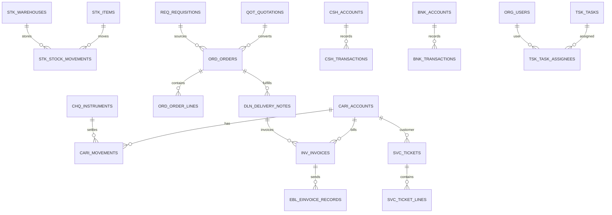
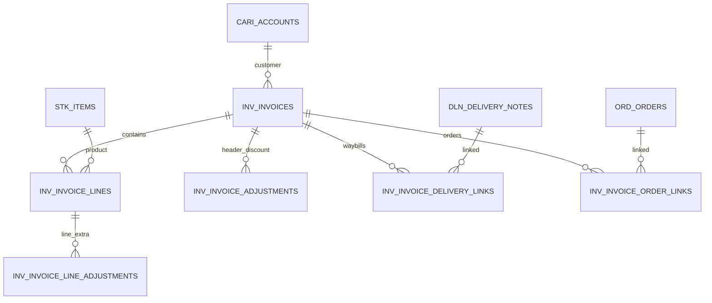
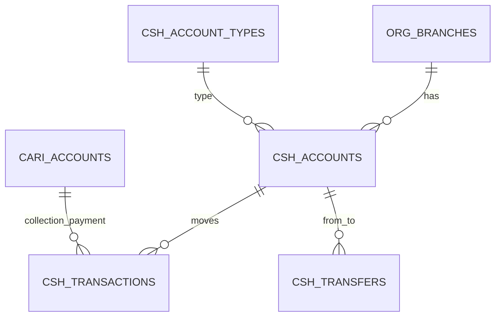
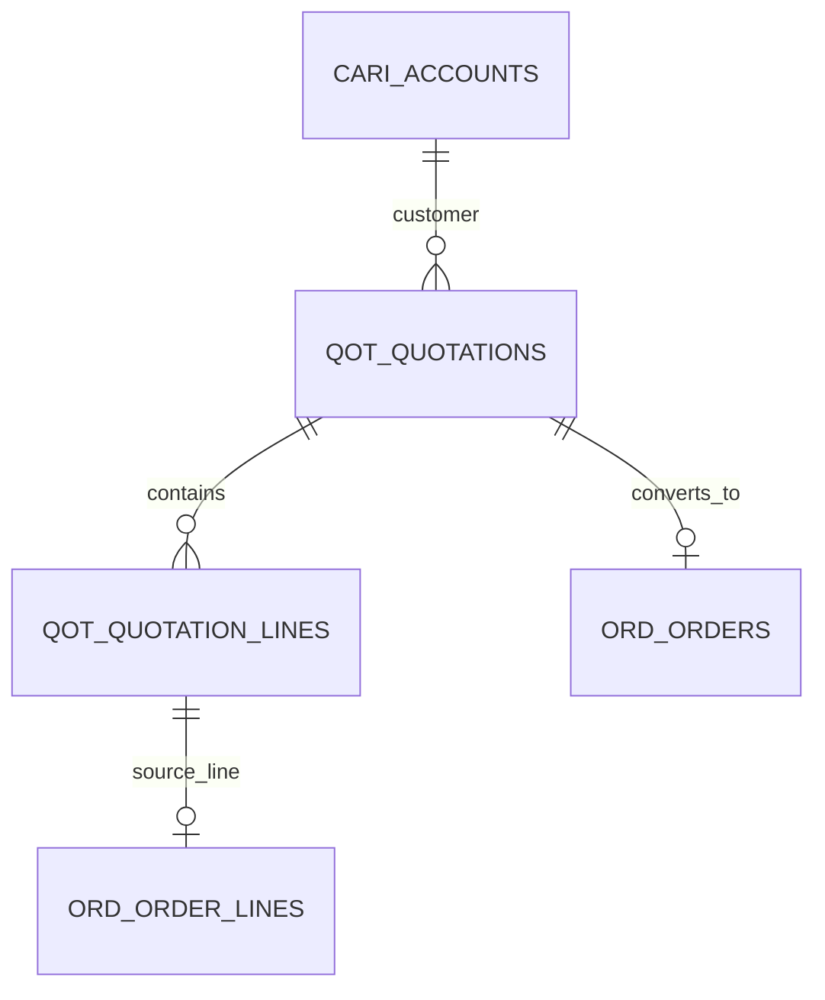
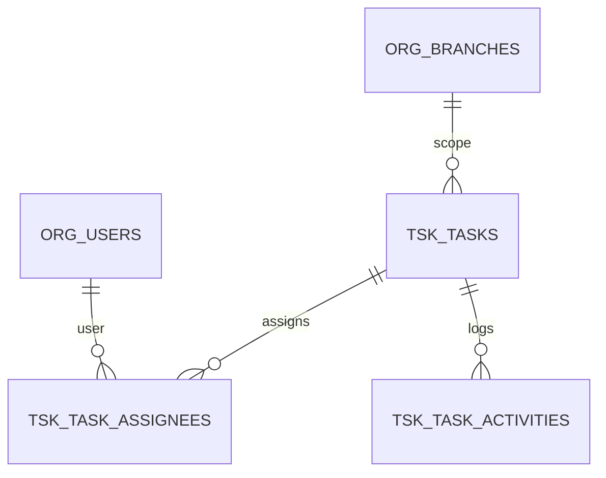
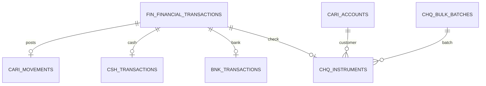
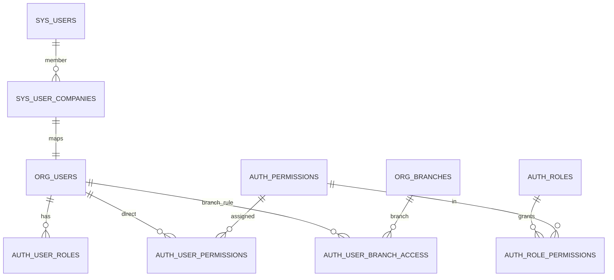

# E-Cari Ön Muhasebe — Veritabanı Tasarım Dokümanı

**Versiyon:** 1.9  
**Tarih:** 2026-06-01  
**Kapsam:** Cari, Stok, Fatura, E-Belge, İrsaliye, Sipariş, Teklif, Talep, Kasa, Banka, Çek-Senet, Servis, Görev, Kullanıcı & Yetkiler, Entegrasyon ve Şirket Ayarları modülleri

> **Alan detayları:** Bölüm **27** (genel alan sözlüğü) · Bölüm **28** (UI ekran eşlemesi)  
> **HTML tasarım referansı:** [HTML-ALAN-REFERANSI.md](./HTML-ALAN-REFERANSI.md) — modül/form alanları birebir eşleme  
> **Toplu SS özeti:** [UI-MODUL-OZETI.md](./UI-MODUL-OZETI.md)

---

## 1. Amaç ve Kapsam

Bu doküman, **E-Cari Ön Muhasebe** uygulamasının ilişkisel veritabanı mimarisini tanımlar. Hedefler:

- Modüller arası **tutarlı ve zorunlu foreign key ilişkileri**
- Yeni modül eklendiğinde mevcut yapıyı bozmadan **genişletilebilirlik**
- **Database-per-customer:** Tek SQL Server instance; her abone müşteri için ayrı operasyonel veritabanı (`ecari_sirket_{kod}`). Tek DB + `tenant_id` modeli **kullanılmaz**.
- **SaaS:** İnternet üzerinden aylık abonelik; veritabanları platform tarafında barındırılır.
- Türkiye **ön muhasebe** ihtiyaçları: cari ekstre, fatura, kasa/banka/çek. Yevmiye / tam muhasebe **kapsam dışı**.
- KDV, tevkifat, e-Fatura/e-İrsaliye, çok para birimi, çok depo

Bu aşamada **fiziksel DDL script üretilmez**; önce metin tutarlılığı sağlanır. Onay sonrası migration scriptleri yazılır.

---

## 2. Mimari Kararlar

**DB motoru:** Microsoft SQL Server 2019+ (tek hedef platform). Tüm tipler: `BIGINT IDENTITY`, `DATETIME2`, `BIT`, `NVARCHAR`, `ROWVERSION`.

### 2.1 Veritabanı Katmanları

| Katman | Açıklama | Örnek |
|--------|----------|-------|
| **Sistem DB** (`ecari_system`) | Kullanıcılar, şirket kayıtları, lisans, modül yetkileri | `sys_companies`, `sys_users` |
| **Şirket DB** (`ecari_sirket_{kod}`) | Operasyonel veri; her şirket izole | `cari_accounts`, `inv_invoices` |

Her abone müşteri kendi veritabanında çalışır (**database-per-customer**). Sistem DB kimlik, abonelik, bağlantı bilgisi ve merkezi yapılandırma tutar. Schema-per-tenant veya tek DB + `tenant_id` yaklaşımı **kullanılmaz**.

### 2.2 Modül İsimlendirme (Tablo Öneki)

| Önek | Modül | Açıklama |
|------|-------|----------|
| `core_` | Çekirdek | Ortak referanslar, numara serileri, döviz |
| `org_` | Organizasyon | Şube, departman, personel |
| `cari_` | Cari | Müşteri/tedarikçi, cari hareket |
| `stk_` | Stok | Ürün, depo, stok hareket |
| `doc_` | Belge çekirdeği | Ortak belge başlık/satır soyutlaması |
| `inv_` | Fatura | Satış/alış faturaları |
| `dln_` | İrsaliye | Sevk irsaliyeleri |
| `ord_` | Sipariş | Satış/alış siparişleri |
| `qot_` | Teklif | Teklifler |
| `req_` | Talep | Satın alma talepleri |
| `csh_` | Kasa | Kasa hesapları ve hareketler |
| `bnk_` | Banka | Banka hesapları ve hareketler |
| `chq_` | Çek-Senet | Çek ve senet portföyü |
| `fin_` | Finansal hareket | Cari + kasa/banka + çek birleşik giriş |
| `auth_` | Kullanıcı & yetki | İzin, rol, şube erişim kısıtı |
| `svc_` | Servis | Servis kayıtları |
| `ebl_` | E-Belge | e-Fatura/e-İrsaliye entegrasyon |
| `int_` | Entegrasyon | API, webhook, senkron log |
| `cfg_` | Ayarlar | Şirket parametreleri |
| `tsk_` | Görev | Şirket görevleri, atama, hatırlatma |

Yeni modül eklendiğinde yeni önek + `core_` / `org_` referanslarına FK ile bağlanır; mevcut tablolar değiştirilmez.

### 2.3 Ortak Sütunlar (Tüm Ana Tablolarda)

Her iş tablosunda aşağıdaki sütunlar zorunludur:

```text
id              BIGINT          PK, IDENTITY
created_at      DATETIME2(3)    NOT NULL, DEFAULT SYSUTCDATETIME()
created_by      BIGINT          FK → org_users.id (NULL olabilir sistem kayıtlarında)
updated_at      DATETIME2(3)    NULL
updated_by      BIGINT          FK → org_users.id
is_deleted      BIT             NOT NULL DEFAULT 0
deleted_at      DATETIME2(3)    NULL
deleted_by      BIGINT          FK → org_users.id
row_version     ROWVERSION      Optimistic concurrency
```

### 2.4 Belge (Document) Tasarım Deseni

Satış/alış belgeleri (Teklif → Sipariş → İrsaliye → Fatura) ortak yapı kullanır:

```text
[Belge Başlık]  1 ──< N  [Belge Satır]
       │
       ├── FK → cari_accounts
       ├── FK → org_branches
       ├── FK → core_currencies
       └── FK → core_document_series (numara serisi)

[Belge Satır]
       ├── FK → stk_items
       ├── FK → stk_units
       ├── FK → stk_warehouses (opsiyonel)
       └── source_line_id → önceki belge satırına referans (zincir)
```

**Belge zinciri:** Teklif satırı → Sipariş satırı → İrsaliye satırı → Fatura satırı. `source_document_type` + `source_line_id` ile izlenir; FK zorunluluğu uygulama katmanında veya CHECK ile doğrulanır.

### 2.5 Genişletilebilirlik Kuralları

1. **Yeni modül** = yeni tablo öneki + `core_` / `cari_` / `stk_` FK'ları; mevcut tabloya sütun eklemekten kaçın.
2. **Özel alanlar:** Faz 1'de **yok**. Faz 2+'da EAV (`core_custom_fields`, `core_custom_field_values`). JSON yalnızca config/entegrasyon (`config_json` vb.) için.
3. **Çoklu dil:** Faz 1–3'te `*_translations` tabloları **yok**; ileride eklenebilir.
4. **Modüller arası gevşek bağ** → `core_entity_links` (polymorphic ilişki).
5. **Entegrasyon** → `int_outbox_events` (outbox pattern); dış sistemler event tüketir.
6. **Numara serileri** → merkezi `core_document_series`; modül bazlı prefix.
7. **Seri/lot:** Ürün kartında `track_serial` / `track_lot` ile açık/kapalı. Takipli üründe irsaliye/fatura satırında seri/lot **zorunlu**; global zorunluluk yok.

---

## 3. Varlık İlişki Diyagramı (Üst Seviye)



---

## 4. Çekirdek ve Organizasyon Modülleri

### 4.1 `core_currencies` — Para Birimleri

| Alan | Tip | Açıklama |
|------|-----|----------|
| code | CHAR(3) | ISO 4217 (TRY, USD, EUR) |
| name | NVARCHAR(100) | Türk Lirası |
| symbol | NVARCHAR(10) | ₺ |
| decimal_places | TINYINT | 2 |
| is_default | BIT | Şirket varsayılanı |

### 4.2 `core_exchange_rates` — Döviz Kurları

| Alan | Tip | Açıklama |
|------|-----|----------|
| currency_id | BIGINT FK | |
| rate_date | DATE | |
| buy_rate | DECIMAL(18,6) | |
| sell_rate | DECIMAL(18,6) | |
| source | NVARCHAR(50) | TCMB, manuel |

**İlişki:** `currency_id` → `core_currencies.id`  
**Unique:** `(currency_id, rate_date)`

### 4.3 `core_tax_rates` — Vergi Oranları

| Alan | Tip | Açıklama |
|------|-----|----------|
| code | NVARCHAR(20) | KDV20, KDV10, KDV1, KDV0 |
| name | NVARCHAR(100) | |
| rate | DECIMAL(5,2) | 20.00 (KDV20 ana oran) |
| tax_type | NVARCHAR(20) | KDV, OTV, TEVKIFAT |
| is_active | BIT | |

### 4.4 `core_document_series` — Belge Numara Serileri

| Alan | Tip | Açıklama |
|------|-----|----------|
| module_code | NVARCHAR(30) | INV, ORD, DLN, QOT, REQ |
| document_type | NVARCHAR(30) | SALES, PURCHASE |
| prefix | NVARCHAR(20) | SF2026 |
| suffix | NVARCHAR(20) | |
| next_number | BIGINT | |
| padding | TINYINT | 6 → 000001 |
| fiscal_year | SMALLINT | |
| branch_id | BIGINT FK NULL | Şube bazlı seri |

### 4.5 `core_payment_terms` — Ödeme Vadeleri

| Alan | Tip | Açıklama |
|------|-----|----------|
| code | NVARCHAR(20) | NET30, PESIN |
| name | NVARCHAR(100) | |
| due_days | INT | 30 |
| discount_days | INT NULL | Erken ödeme |
| discount_rate | DECIMAL(5,2) NULL | |

### 4.6 `core_entity_links` — Modüller Arası Bağ (Polymorphic)

| Alan | Tip | Açıklama |
|------|-----|----------|
| source_module | NVARCHAR(30) | SVC |
| source_id | BIGINT | |
| target_module | NVARCHAR(30) | INV |
| target_id | BIGINT | |
| link_type | NVARCHAR(50) | INVOICED, RELATED |

**Index:** `(source_module, source_id)`, `(target_module, target_id)`

### 4.7 `org_branches` — Şubeler

| Alan | Tip | Açıklama |
|------|-----|----------|
| code | NVARCHAR(20) UNIQUE | |
| name | NVARCHAR(200) | |
| address | NVARCHAR(500) | |
| city_id | BIGINT FK | |
| tax_office | NVARCHAR(100) | |
| tax_number | NVARCHAR(20) | |
| is_headquarters | BIT | |
| is_active | BIT | |

### 4.8 `org_departments` — Departmanlar

| Alan | Tip | Açıklama |
|------|-----|----------|
| branch_id | BIGINT FK | |
| parent_id | BIGINT FK NULL | Hiyerarşi |
| code | NVARCHAR(20) | |
| name | NVARCHAR(200) | |

### 4.9 `org_users` — Kullanıcılar (Şirket DB)

> **UI eşlemesi:** Bölüm **27.17**, **28.27–28.29**

| Alan | Tip | Açıklama |
|------|-----|----------|
| system_user_id | BIGINT | Sistem DB `sys_users.id` |
| username | NVARCHAR(100) | Giriş adı (opsiyonel) |
| full_name | NVARCHAR(200) | Ad soyad |
| email | NVARCHAR(254) | |
| phone | NVARCHAR(30) | İsteğe bağlı |
| department_id | BIGINT FK NULL | |
| default_branch_id | BIGINT FK NULL | Varsayılan şube |
| is_active | BIT | |
| invited_at | DATETIME2 NULL | Davet gönderildi |
| joined_at | DATETIME2 NULL | Şirkete katıldı |

### 4.10 `org_employees` — Personel

| Alan | Tip | Açıklama |
|------|-----|----------|
| user_id | BIGINT FK NULL | |
| employee_code | NVARCHAR(20) | |
| first_name | NVARCHAR(100) | |
| last_name | NVARCHAR(100) | |
| hire_date | DATE | |
| department_id | BIGINT FK | |

---

## 4A. Kullanıcı ve Yetki Modülü (`auth_`)

Kimlik doğrulama **sistem DB** (`sys_users`); yetki ve şube kısıtı **şirket DB** (`auth_*`, `org_users`).

### 4A.1 `sys_users` — Global Kullanıcı (Sistem DB)

| Alan | Tip | Açıklama |
|------|-----|----------|
| email | NVARCHAR(254) UNIQUE | Giriş e-postası |
| password_hash | NVARCHAR(255) | bcrypt/argon2 |
| full_name | NVARCHAR(200) | |
| phone | NVARCHAR(30) NULL | |
| is_active | BIT | |
| email_verified_at | DATETIME2 NULL | |
| last_login_at | DATETIME2 NULL | |
| password_changed_at | DATETIME2 NULL | |

### 4A.2 `sys_user_companies` — Kullanıcı ↔ Şirket

| Alan | Tip | Açıklama |
|------|-----|----------|
| user_id | BIGINT FK | `sys_users` |
| company_id | BIGINT FK | `sys_companies` |
| org_user_id | BIGINT | Şirket DB `org_users.id` |
| is_default_company | BIT | Varsayılan şirket |
| status | NVARCHAR(20) | ACTIVE, INVITED, SUSPENDED |

**Unique:** `(user_id, company_id)`

### 4A.3 `auth_permission_groups` — İzin Grupları (UI ağacı üst düğüm)

| Alan | Tip | Açıklama |
|------|-----|----------|
| code | NVARCHAR(50) | SETTINGS, HOME, COMPANY, BRANCH |
| name | NVARCHAR(100) | Ayarlar, Ana Sayfa… |
| parent_id | BIGINT FK NULL | Hiyerarşi |
| sort_order | INT | |

### 4A.4 `auth_permissions` — İzin Tanımları

| Alan | Tip | Açıklama |
|------|-----|----------|
| group_id | BIGINT FK | `auth_permission_groups` |
| code | NVARCHAR(100) UNIQUE | `COMPANY.EDIT` |
| name | NVARCHAR(200) | Firma Bilgileri Düzenle |
| module_code | NVARCHAR(30) | CFG, ORG, CARI… |
| action_code | NVARCHAR(30) | VIEW, CREATE, EDIT, DELETE |
| sort_order | INT | |
| is_active | BIT | |

**SS örnek izinler:**

| code | name |
|------|------|
| SETTINGS.RESET_COMPANY | Şirket Verilerini Sıfırla |
| HOME.VIEW | Ana Sayfayı Görüntüle |
| COMPANY.VIEW | Firma Bilgilerini Görüntüle |
| COMPANY.EDIT | Firma Bilgileri Düzenle |
| COMPANY.DELETE | Firma Bilgileri Sil |
| BRANCH.VIEW | Şubeleri Görüntüle |
| BRANCH.CREATE | Şube Oluştur |

### 4A.5 `auth_roles` — Roller

| Alan | Tip | Açıklama |
|------|-----|----------|
| code | NVARCHAR(50) | ADMIN, MUHASEBE, SATIS |
| name | NVARCHAR(100) | |
| is_system | BIT | Silinemez sistem rolü |
| is_active | BIT | |

### 4A.6 `auth_role_permissions` — Rol ↔ İzin

| Alan | Tip | Açıklama |
|------|-----|----------|
| role_id | BIGINT FK | |
| permission_id | BIGINT FK | |

**Unique:** `(role_id, permission_id)`

### 4A.7 `auth_user_roles` — Kullanıcı ↔ Rol

| Alan | Tip | Açıklama |
|------|-----|----------|
| org_user_id | BIGINT FK | `org_users` |
| role_id | BIGINT FK | |

**Unique:** `(org_user_id, role_id)`

### 4A.8 `auth_user_permissions` — Kullanıcıya Doğrudan İzin (UI checkbox)

Rol dışı bireysel izin; formdaki işaretli kutular buraya yazılır.

| Alan | Tip | Açıklama |
|------|-----|----------|
| org_user_id | BIGINT FK | |
| permission_id | BIGINT FK | |
| is_granted | BIT | 1=verildi, 0=reddedildi (rol override) |

**Unique:** `(org_user_id, permission_id)`

**Etkin izin hesabı:** `(rol izinleri ∪ doğrudan verilen) − doğrudan reddedilen`

### 4A.9 `auth_user_branch_access` — Şube Erişim Kısıtlaması

| Alan | Tip | Açıklama |
|------|-----|----------|
| org_user_id | BIGINT FK | |
| branch_id | BIGINT FK | `org_branches` |
| access_rule | NVARCHAR(20) | `DENY`, `ALLOW` |

**UI kuralı (SS metni):**

```text
[Hiç şube seçilmedi]
  → Varsayılan: en fazla 3 şube (cfg: auth.max_default_branches)
  → default_branch_id öncelikli

[Şube kısıtı aktif + şubeler işaretlendi]
  → İşaretli şubeler: access_rule = DENY (erişim YOK)
  → İşaretsiz şubeler: erişim VAR
```

Şube kısıt modu ve max şube sayısı → `auth_user_settings` (4A.10).

### 4A.10 `auth_user_settings` — Kullanıcı Yetki Ayarları

| Alan | Tip | Açıklama |
|------|-----|----------|
| org_user_id | BIGINT FK UNIQUE | |
| is_branch_restriction_enabled | BIT | Şube kısıt modu açık |
| max_branch_access | INT | Varsayılan 3 |
| permission_summary_cache | NVARCHAR(500) | Liste **İzinler** kolonu için |

### 4A.11 View’lar

| View | Açıklama |
|------|----------|
| `v_auth_user_list` | Liste: ad, e-posta, telefon, izin özeti, created_at |
| `v_auth_user_effective_permissions` | Kullanıcının efektif izin kümesi |

---

## 5. Şirket Ayarları Modülü (`cfg_`)

### 5.1 `cfg_company_profile` — Şirket Kimlik Bilgileri

| Alan | Tip | Açıklama |
|------|-----|----------|
| legal_name | NVARCHAR(300) | Ticari unvan |
| trade_name | NVARCHAR(300) | |
| tax_number | NVARCHAR(11) | VKN/TCKN |
| tax_office | NVARCHAR(100) | |
| mersis_no | NVARCHAR(20) | |
| trade_registry_no | NVARCHAR(50) | |
| address | NVARCHAR(500) | |
| city_id | BIGINT FK | |
| district_id | BIGINT FK | |
| country_code | CHAR(2) | TR |
| phone | NVARCHAR(30) | |
| email | NVARCHAR(254) | |
| website | NVARCHAR(200) | |
| logo_path | NVARCHAR(500) | |
| default_currency_id | BIGINT FK | |
| fiscal_year_start_month | TINYINT | 1=Ocak |

### 5.2 `cfg_fiscal_periods` — Mali Dönemler

| Alan | Tip | Açıklama |
|------|-----|----------|
| year | SMALLINT | |
| period_no | TINYINT | 1-12 veya 1-4 |
| start_date | DATE | |
| end_date | DATE | |
| is_closed | BIT | Kapanış sonrası kayıt engeli |

### 5.3 `cfg_module_settings` — Modül Parametreleri

| Alan | Tip | Açıklama |
|------|-----|----------|
| module_code | NVARCHAR(30) | INV, STK, CARI |
| setting_key | NVARCHAR(100) | allow_negative_stock |
| setting_value | NVARCHAR(MAX) | JSON veya string |
| data_type | NVARCHAR(20) | BOOL, INT, JSON |

**Unique:** `(module_code, setting_key)`

### 5.4 `cfg_approval_workflows` — Onay Akışları (Talep, Teklif vb.)

| Alan | Tip | Açıklama |
|------|-----|----------|
| module_code | NVARCHAR(30) | |
| document_type | NVARCHAR(30) | |
| min_amount | DECIMAL(18,2) | |
| max_amount | DECIMAL(18,2) NULL | |
| approver_role_id | BIGINT FK | |
| step_order | INT | |

---

## 6. Cari Modülü (`cari_`)

> **Not:** Bölüm 6–20 modül **özet** tablolarıdır. Tam alan listesi Bölüm **27.x**'tedir. §27.18'de listelenen ek tablolar yol haritası (§26) ile eşleştirilmiştir.

### 6.1 `cari_account_types` — Cari Tipleri

| Değer | Açıklama |
|-------|----------|
| CUSTOMER | Müşteri |
| SUPPLIER | Tedarikçi |
| BOTH | Her ikisi |
| PERSONNEL | Personel cari |
| OTHER | Diğer |

### 6.2 `cari_accounts` — Cari Kartları

> **Tam alan listesi (Türkçe etiketler, telefon, e-posta vb.):** Bölüm **27.2.1**

| Alan | Tip | Açıklama |
|------|-----|----------|
| code | NVARCHAR(30) UNIQUE | Cari kodu |
| account_type | NVARCHAR(20) | CUSTOMER, SUPPLIER, BOTH |
| title | NVARCHAR(300) | Ünvan / Cari adı |
| short_name | NVARCHAR(100) | Kısa ad |
| person_type | NVARCHAR(20) | TUZEL_KISI, GERCEK_KISI |
| phone | NVARCHAR(30) | Telefon |
| mobile | NVARCHAR(30) | Cep telefonu |
| fax | NVARCHAR(30) | Faks |
| email | NVARCHAR(254) | E-posta |
| website | NVARCHAR(200) | Web sitesi |
| tax_number | NVARCHAR(11) | VKN |
| tax_office | NVARCHAR(100) | Vergi dairesi |
| identity_number | NVARCHAR(11) | TCKN (şahıs) |
| is_einvoice_user | BIT | GİB e-Fatura mükellefi |
| einvoice_alias | NVARCHAR(200) | Posta kutusu |
| payment_term_id | BIGINT FK NULL | |
| currency_id | BIGINT FK | Cari para birimi |
| credit_limit | DECIMAL(18,2) | |
| risk_limit | DECIMAL(18,2) | |
| discount_rate | DECIMAL(5,2) | |
| price_list_id | BIGINT FK NULL | stk_price_lists |
| sales_rep_id | BIGINT FK NULL | org_employees |
| branch_id | BIGINT FK NULL | Sorumlu şube |
| is_active | BIT | |
| notes | NVARCHAR(MAX) | |

**İlişkiler:**
- `payment_term_id` → `core_payment_terms.id`
- `currency_id` → `core_currencies.id`
- `price_list_id` → `stk_price_lists.id`

### 6.3 `cari_addresses` — Cari Adresleri

| Alan | Tip | Açıklama |
|------|-----|----------|
| account_id | BIGINT FK | |
| address_type | NVARCHAR(20) | BILLING, SHIPPING, OTHER |
| title | NVARCHAR(100) | Merkez, Şube |
| address_line1 | NVARCHAR(300) | |
| address_line2 | NVARCHAR(300) | |
| city_id | BIGINT FK | |
| district_id | BIGINT FK | |
| postal_code | NVARCHAR(10) | |
| country_code | CHAR(2) | |
| is_default | BIT | |

### 6.4 `cari_contacts` — Yetkili Kişiler

| Alan | Tip | Açıklama |
|------|-----|----------|
| account_id | BIGINT FK | |
| full_name | NVARCHAR(200) | |
| title | NVARCHAR(100) | Satın alma müdürü |
| phone | NVARCHAR(30) | |
| mobile | NVARCHAR(30) | |
| email | NVARCHAR(254) | |
| is_primary | BIT | |

### 6.5 `cari_bank_accounts` — Cari Banka Hesapları

| Alan | Tip | Açıklama |
|------|-----|----------|
| account_id | BIGINT FK | |
| bank_name | NVARCHAR(100) | |
| branch_name | NVARCHAR(100) | |
| iban | NVARCHAR(34) | |
| account_no | NVARCHAR(30) | |
| currency_id | BIGINT FK | |

### 6.6 `cari_movements` — Cari Hareketler (Merkez Tablo)

Tüm finansal hareketler burada toplanır; fatura, kasa, banka, çek-senet bu tabloya bağlanır.

| Alan | Tip | Açıklama |
|------|-----|----------|
| account_id | BIGINT FK | cari_accounts |
| movement_date | DATE | |
| due_date | DATE NULL | Vade |
| movement_type | NVARCHAR(30) | INVOICE, PAYMENT, COLLECTION, OPENING, ADJUSTMENT |
| debit | DECIMAL(18,2) | Borç |
| credit | DECIMAL(18,2) | Alacak |
| currency_id | BIGINT FK | |
| exchange_rate | DECIMAL(18,6) | |
| amount_foreign | DECIMAL(18,2) | Döviz tutarı |
| document_module | NVARCHAR(30) | INV, CSH, BNK, CHQ |
| document_id | BIGINT | Kaynak belge |
| document_no | NVARCHAR(50) | |
| description | NVARCHAR(500) | |
| fiscal_period_id | BIGINT FK | |
| is_reconciled | BIT | Mutabakat |

**Kural:** `debit` ve `credit` aynı anda dolu olamaz.  
**Index:** `(account_id, movement_date)`, `(document_module, document_id)`

### 6.7 `cari_balance_snapshots` — Dönem Bakiye Özetleri (Performans)

| Alan | Tip | Açıklama |
|------|-----|----------|
| account_id | BIGINT FK | |
| fiscal_period_id | BIGINT FK | |
| opening_debit | DECIMAL(18,2) | |
| opening_credit | DECIMAL(18,2) | |
| period_debit | DECIMAL(18,2) | |
| period_credit | DECIMAL(18,2) | |
| closing_debit | DECIMAL(18,2) | |
| closing_credit | DECIMAL(18,2) | |

---

## 7. Stok Modülü (`stk_`)

### 7.1 `stk_units` — Birimler

| Alan | Tip | Açıklama |
|------|-----|----------|
| code | NVARCHAR(10) | ADET, KG, LT |
| name | NVARCHAR(50) | |
| is_base | BIT | |

### 7.2 `stk_unit_conversions` — Birim Dönüşümleri

| Alan | Tip | Açıklama |
|------|-----|----------|
| item_id | BIGINT FK NULL | Ürüne özel |
| from_unit_id | BIGINT FK | |
| to_unit_id | BIGINT FK | |
| factor | DECIMAL(18,6) | 1 koli = 12 adet |

### 7.3 `stk_categories` — Stok Kategorileri

| Alan | Tip | Açıklama |
|------|-----|----------|
| parent_id | BIGINT FK NULL | |
| code | NVARCHAR(30) | |
| name | NVARCHAR(200) | |
| path | NVARCHAR(500) | /1/5/12/ materialized path |

### 7.4 `stk_brands` — Markalar

| Alan | Tip | Açıklama |
|------|-----|----------|
| code | NVARCHAR(30) | |
| name | NVARCHAR(100) | |

### 7.5 `stk_items` — Stok Kartları

| Alan | Tip | Açıklama |
|------|-----|----------|
| code | NVARCHAR(50) UNIQUE | Stok kodu |
| barcode | NVARCHAR(50) | |
| name | NVARCHAR(300) | |
| item_type | NVARCHAR(20) | PRODUCT, SERVICE, RAW, SEMI, FINISHED |
| category_id | BIGINT FK | |
| brand_id | BIGINT FK NULL | |
| base_unit_id | BIGINT FK | |
| purchase_unit_id | BIGINT FK NULL | |
| sales_unit_id | BIGINT FK NULL | |
| tax_rate_id | BIGINT FK | |
| purchase_price | DECIMAL(18,4) | |
| sales_price | DECIMAL(18,4) | |
| currency_id | BIGINT FK | |
| min_stock_level | DECIMAL(18,4) | |
| max_stock_level | DECIMAL(18,4) | |
| track_serial | BIT | Seri no takibi; açıksa belge satırında zorunlu |
| track_lot | BIT | Parti/lot takibi; açıksa belge satırında zorunlu |
| track_expiry | BIT | SKT |
| is_active | BIT | |
| weight | DECIMAL(18,4) NULL | |
| volume | DECIMAL(18,4) NULL | |
| gtip_code | CHAR(12) | 12 haneli rakam (Gümrük tarife) |
| description | NVARCHAR(MAX) | |

### 7.6 `stk_warehouses` — Depolar

| Alan | Tip | Açıklama |
|------|-----|----------|
| branch_id | BIGINT FK | |
| code | NVARCHAR(20) | |
| name | NVARCHAR(100) | |
| address | NVARCHAR(500) | |
| is_default | BIT | |
| is_active | BIT | |

### 7.7 `stk_stock_balances` — Anlık Stok Bakiyesi

| Alan | Tip | Açıklama |
|------|-----|----------|
| item_id | BIGINT FK | |
| warehouse_id | BIGINT FK | |
| quantity | DECIMAL(18,4) | |
| reserved_quantity | DECIMAL(18,4) | Sipariş rezervi |
| available_quantity | COMPUTED | quantity - reserved |

**Unique:** `(item_id, warehouse_id)`

### 7.8 `stk_stock_movements` — Stok Hareketleri

| Alan | Tip | Açıklama |
|------|-----|----------|
| item_id | BIGINT FK | |
| warehouse_id | BIGINT FK | |
| movement_date | DATETIME2 | |
| movement_type | NVARCHAR(30) | IN, OUT, TRANSFER, ADJUSTMENT |
| quantity | DECIMAL(18,4) | + giriş, - çıkış |
| unit_id | BIGINT FK | |
| unit_price | DECIMAL(18,4) | |
| document_module | NVARCHAR(30) | INV, DLN, ORD |
| document_id | BIGINT | |
| document_line_id | BIGINT | |
| lot_no | NVARCHAR(50) NULL | |
| serial_no | NVARCHAR(50) NULL | |
| expiry_date | DATE NULL | |

### 7.9 `stk_price_lists` — Fiyat Listeleri

| Alan | Tip | Açıklama |
|------|-----|----------|
| code | NVARCHAR(20) | |
| name | NVARCHAR(100) | |
| currency_id | BIGINT FK | |
| start_date | DATE | |
| end_date | DATE NULL | |
| is_active | BIT | |

### 7.10 `stk_price_list_items` — Fiyat Listesi Satırları

| Alan | Tip | Açıklama |
|------|-----|----------|
| price_list_id | BIGINT FK | |
| item_id | BIGINT FK | |
| unit_id | BIGINT FK | |
| price | DECIMAL(18,4) | |
| min_quantity | DECIMAL(18,4) | Kademeli fiyat |

---

## 8. Belge Modülleri (Ortak Yapı)

Aşağıdaki modüller **aynı satır mantığını** paylaşır. Her modül kendi başlık/satır tablosuna sahiptir; ortak sütunlar tutarlıdır.

### 8.1 Ortak Başlık Alanları

| Alan | Tip | Açıklama |
|------|-----|----------|
| document_no | NVARCHAR(50) | |
| document_date | DATE | |
| document_type | NVARCHAR(20) | SALES, PURCHASE |
| status | NVARCHAR(20) | DRAFT, APPROVED, CANCELLED, CLOSED |
| account_id | BIGINT FK | cari_accounts |
| branch_id | BIGINT FK | |
| warehouse_id | BIGINT FK NULL | |
| currency_id | BIGINT FK | |
| exchange_rate | DECIMAL(18,6) | |
| payment_term_id | BIGINT FK NULL | |
| due_date | DATE NULL | |
| subtotal | DECIMAL(18,2) | |
| discount_total | DECIMAL(18,2) | |
| tax_total | DECIMAL(18,2) | |
| withholding_total | DECIMAL(18,2) | Tevkifat |
| grand_total | DECIMAL(18,2) | |
| notes | NVARCHAR(MAX) | |
| internal_notes | NVARCHAR(MAX) | |
| sales_rep_id | BIGINT FK NULL | |
| approved_by | BIGINT FK NULL | |
| approved_at | DATETIME2 NULL | |
| source_module | NVARCHAR(30) NULL | Önceki belge |
| source_id | BIGINT NULL | |

### 8.2 Ortak Satır Alanları

| Alan | Tip | Açıklama |
|------|-----|----------|
| line_no | INT | |
| item_id | BIGINT FK NULL | Hizmet satırında NULL |
| description | NVARCHAR(500) | |
| quantity | DECIMAL(18,4) | |
| unit_id | BIGINT FK | |
| unit_price | DECIMAL(18,4) | |
| discount_rate | DECIMAL(5,2) | |
| discount_amount | DECIMAL(18,2) | |
| tax_rate_id | BIGINT FK | |
| tax_amount | DECIMAL(18,2) | |
| withholding_rate | DECIMAL(5,2) | |
| withholding_amount | DECIMAL(18,2) | |
| line_total | DECIMAL(18,2) | |
| warehouse_id | BIGINT FK NULL | |
| delivered_quantity | DECIMAL(18,4) | Sevk edilen |
| invoiced_quantity | DECIMAL(18,4) | Faturalanan |
| source_line_id | BIGINT NULL | Zincir referansı |

---

## 9. Teklif Modülü (`qot_`)

> **Liste ekranı UI eşlemesi:** Bölüm **28.17–28.19**

### 9.1 `qot_quotations` — Teklif Başlık

Ortak başlık alanları +:

| Alan | Tip | Açıklama |
|------|-----|----------|
| valid_until | DATE | Geçerlilik tarihi |
| revision_no | INT | Revizyon |
| parent_quotation_id | BIGINT FK NULL | Revizyon zinciri |
| probability | DECIMAL(5,2) | Kazanma olasılığı % |

### 9.2 `qot_quotation_lines` — Teklif Satırları

Ortak satır alanları.

**İlişkiler:**
- `account_id` → `cari_accounts`
- `qot_quotations.id` ← `qot_quotation_lines.quotation_id`
- Dönüşüm: `ord_orders.source_module='QOT'`, `source_id`

---

## 10. Talep Modülü (`req_`)

### 10.1 `req_requisitions` — Talep Başlık

| Alan | Tip | Açıklama |
|------|-----|----------|
| document_no | NVARCHAR(50) | |
| request_date | DATE | |
| required_date | DATE | İhtiyaç tarihi |
| status | NVARCHAR(20) | DRAFT, PENDING, APPROVED, REJECTED, ORDERED |
| requester_id | BIGINT FK | org_employees |
| department_id | BIGINT FK | |
| branch_id | BIGINT FK | |
| priority | NVARCHAR(20) | LOW, NORMAL, HIGH, URGENT |
| notes | NVARCHAR(MAX) | |

### 10.2 `req_requisition_lines` — Talep Satırları

| Alan | Tip | Açıklama |
|------|-----|----------|
| requisition_id | BIGINT FK | |
| line_no | INT | |
| item_id | BIGINT FK | |
| description | NVARCHAR(500) | |
| quantity | DECIMAL(18,4) | |
| unit_id | BIGINT FK | |
| estimated_unit_price | DECIMAL(18,4) | |
| warehouse_id | BIGINT FK NULL | |
| ordered_quantity | DECIMAL(18,4) | Siparişe aktarılan |

### 10.3 `req_approval_history` — Onay Geçmişi

| Alan | Tip | Açıklama |
|------|-----|----------|
| requisition_id | BIGINT FK | |
| step_order | INT | |
| approver_id | BIGINT FK | org_users |
| action | NVARCHAR(20) | APPROVED, REJECTED |
| action_at | DATETIME2 | |
| comments | NVARCHAR(500) | |

---

## 11. Sipariş Modülü (`ord_`)

### 11.1 `ord_orders` — Sipariş Başlık

Ortak başlık +:

| Alan | Tip | Açıklama |
|------|-----|----------|
| order_type | NVARCHAR(20) | SALES, PURCHASE |
| delivery_date | DATE | |
| delivery_address_id | BIGINT FK NULL | cari_addresses |
| shipment_method | NVARCHAR(50) | |

### 11.2 `ord_order_lines` — Sipariş Satırları

Ortak satır + `ordered_quantity`, `delivered_quantity`, `invoiced_quantity`.

**Zincir:** Talep → Sipariş (`source_module='REQ'`), Teklif → Sipariş (`source_module='QOT'`)

---

## 12. İrsaliye Modülü (`dln_`)

### 12.1 `dln_delivery_notes` — İrsaliye Başlık

Ortak başlık +:

| Alan | Tip | Açıklama |
|------|-----|----------|
| shipment_date | DATETIME2 | Sevk tarihi |
| driver_name | NVARCHAR(100) | |
| vehicle_plate | NVARCHAR(20) | |
| transport_type | NVARCHAR(30) | KENDI, KARGO |
| e_waybill_uuid | NVARCHAR(50) NULL | e-İrsaliye UUID |
| e_waybill_status | NVARCHAR(30) | |

### 12.2 `dln_delivery_note_lines` — İrsaliye Satırları

Ortak satır alanları.

**İlişki:** Sipariş satırından `source_line_id` ile türetilir.

---

## 13. Fatura Modülü (`inv_`)

### 13.1 `inv_invoices` — Fatura Başlık

> **Tam UI alan listesi:** Bölüm **27.8.1** ve **28.9–28.12**

Ortak başlık +:

| Alan | Tip | Açıklama |
|------|-----|----------|
| document_time | TIME(0) | Fatura saati (UI) |
| is_order_info_enabled | BIT | Sipariş bilgileri toggle |
| invoice_type | NVARCHAR(30) | SALES, PURCHASE, RETURN_SALES, RETURN_PURCHASE |
| invoice_scenario | NVARCHAR(30) | TEMEL, TICARI, IHRACAT |
| e_invoice_type | NVARCHAR(30) | EFATURA, EARSIV, NONE |
| e_invoice_uuid | NVARCHAR(50) | GİB UUID |
| e_invoice_status | NVARCHAR(30) | DRAFT, SENT, ACCEPTED, REJECTED |
| withholding_type | NVARCHAR(30) | Tevkifat kodu |
| export_registered | BIT | İhraç kayıtlı |

### 13.2 `inv_invoice_lines` — Fatura Satırları

Ortak satır +:

| Alan | Tip | Açıklama |
|------|-----|----------|
| gtip_code | CHAR(12) | |
| exemption_reason | NVARCHAR(100) | KDV istisna |

### 13.3 `inv_invoice_taxes` — Fatura Vergi Özeti (Başlık Seviyesi)

| Alan | Tip | Açıklama |
|------|-----|----------|
| invoice_id | BIGINT FK | |
| tax_rate_id | BIGINT FK | |
| tax_base | DECIMAL(18,2) | Matrah |
| tax_amount | DECIMAL(18,2) | |

### 13.4 `inv_invoice_payments` — Fatura Ödeme Planı

| Alan | Tip | Açıklama |
|------|-----|----------|
| invoice_id | BIGINT FK | |
| installment_no | INT | |
| due_date | DATE | |
| amount | DECIMAL(18,2) | |
| paid_amount | DECIMAL(18,2) | |
| payment_status | NVARCHAR(20) | OPEN, PARTIAL, PAID |

**Cari bağlantı:** Fatura onayında `cari_movements` kaydı oluşturulur (`movement_type=INVOICE`).

---

## 14. E-Belge Modülü (`ebl_`)

Entegratörden bağımsız soyutlama katmanı. **Faz 1 birincil entegratör: EDM** (diğerleri — Uyumsoft, Logo vb. — aynı tablo yapısında kalır, seed'de pasif).

### 14.1 `ebl_integrators` — Entegratör Tanımları

| Alan | Tip | Açıklama |
|------|-----|----------|
| code | NVARCHAR(30) | EDM (Faz 1 varsayılan), UYUMSOFT |
| name | NVARCHAR(100) | |
| api_base_url | NVARCHAR(500) | |
| is_active | BIT | |

### 14.2 `ebl_integrator_credentials` — Entegratör Kimlik Bilgileri

| Alan | Tip | Açıklama |
|------|-----|----------|
| integrator_id | BIGINT FK | |
| username | NVARCHAR(200) | Şifreli |
| password_encrypted | VARBINARY(MAX) | |
| api_key_encrypted | VARBINARY(MAX) | |
| environment | NVARCHAR(20) | TEST, PRODUCTION |
| branch_id | BIGINT FK NULL | |

### 14.3 `ebl_einvoice_records` — e-Fatura Kayıtları

| Alan | Tip | Açıklama |
|------|-----|----------|
| invoice_id | BIGINT FK | inv_invoices |
| integrator_id | BIGINT FK | |
| uuid | NVARCHAR(50) UNIQUE | |
| envelope_uuid | NVARCHAR(50) | |
| ettn | NVARCHAR(50) | |
| scenario | NVARCHAR(30) | |
| profile_id | NVARCHAR(30) | TEMELFATURA, TICARIFATURA |
| status | NVARCHAR(30) | |
| status_message | NVARCHAR(500) | |
| sent_at | DATETIME2 | |
| response_at | DATETIME2 | |
| ubl_xml_path | NVARCHAR(500) | |
| pdf_path | NVARCHAR(500) | |

### 14.4 `ebl_ewaybill_records` — e-İrsaliye Kayıtları

| Alan | Tip | Açıklama |
|------|-----|----------|
| delivery_note_id | BIGINT FK | dln_delivery_notes |
| integrator_id | BIGINT FK | |
| uuid | NVARCHAR(50) | |
| status | NVARCHAR(30) | |
| ubl_xml_path | NVARCHAR(500) | |

### 14.5 `ebl_incoming_documents` — Gelen e-Belgeler

| Alan | Tip | Açıklama |
|------|-----|----------|
| document_type | NVARCHAR(30) | EINVOICE, EWAYBILL |
| uuid | NVARCHAR(50) | |
| sender_vkn | NVARCHAR(11) | |
| sender_title | NVARCHAR(300) | |
| document_date | DATE | |
| amount | DECIMAL(18,2) | |
| status | NVARCHAR(30) | NEW, MATCHED, PROCESSED |
| matched_invoice_id | BIGINT FK NULL | |
| raw_xml_path | NVARCHAR(500) | |

### 14.6 `ebl_status_history` — Durum Geçmişi

| Alan | Tip | Açıklama |
|------|-----|----------|
| record_module | NVARCHAR(30) | EINVOICE, EWAYBILL |
| record_id | BIGINT | |
| old_status | NVARCHAR(30) | |
| new_status | NVARCHAR(30) | |
| changed_at | DATETIME2 | |
| response_payload | NVARCHAR(MAX) | JSON |

---

## 15. Kasa Modülü (`csh_`)

### 15.1 `csh_accounts` — Kasa Tanımları

> **Tam UI alan listesi:** Bölüm **27.10.1** ve **28.14**

| Alan | Tip | Açıklama |
|------|-----|----------|
| code | NVARCHAR(20) | Otomatik seri (UI’da yok) |
| name | NVARCHAR(100) | Kasa adı |
| cash_type | NVARCHAR(30) | FIZIKI_KASA, POS, DIGITAL… |
| branch_id | BIGINT FK | Şube (ör. Merkez Şube) |
| currency_id | BIGINT FK | |
| opening_balance | DECIMAL(18,2) | Açılış tutarı |
| opening_balance_direction | NVARCHAR(10) | GELIR, GIDER |
| color_hex | CHAR(7) | UI renk (#00ff11) |
| is_official | BIT | Resmi kasa |
| iban | NVARCHAR(34) | Sadece banka tipinde; fiziki kasada NULL |
| is_active | BIT | |

### 15.2 `csh_transactions` — Kasa Hareketleri

| Alan | Tip | Açıklama |
|------|-----|----------|
| cash_account_id | BIGINT FK | |
| transaction_date | DATE | |
| transaction_type | NVARCHAR(30) | COLLECTION, PAYMENT, TRANSFER_IN, TRANSFER_OUT |
| account_id | BIGINT FK NULL | Cari |
| amount | DECIMAL(18,2) | |
| currency_id | BIGINT FK | |
| exchange_rate | DECIMAL(18,6) | |
| payment_method | NVARCHAR(30) | CASH, CARD |
| document_no | NVARCHAR(50) | |
| description | NVARCHAR(500) | |
| cari_movement_id | BIGINT FK NULL | Oluşan cari hareket |

### 15.3 `csh_transfers` — Kasa Virmanları

| Alan | Tip | Açıklama |
|------|-----|----------|
| from_account_id | BIGINT FK | |
| to_account_id | BIGINT FK | |
| transfer_date | DATE | |
| amount | DECIMAL(18,2) | |
| out_transaction_id | BIGINT FK | |
| in_transaction_id | BIGINT FK | |

---

## 16. Banka Modülü (`bnk_`)

### 16.1 `bnk_banks` — Banka Tanımları (Referans)

| Alan | Tip | Açıklama |
|------|-----|----------|
| code | NVARCHAR(10) | SWIFT / banka kodu |
| name | NVARCHAR(100) | |

### 16.2 `bnk_accounts` — Banka Hesapları

| Alan | Tip | Açıklama |
|------|-----|----------|
| bank_id | BIGINT FK | |
| branch_id | BIGINT FK | org şube |
| account_name | NVARCHAR(100) | |
| account_no | NVARCHAR(30) | |
| iban | NVARCHAR(34) | |
| currency_id | BIGINT FK | |
| opening_balance | DECIMAL(18,2) | |
| is_active | BIT | |

### 16.3 `bnk_transactions` — Banka Hareketleri

| Alan | Tip | Açıklama |
|------|-----|----------|
| bank_account_id | BIGINT FK | |
| transaction_date | DATE | |
| value_date | DATE | Valör |
| transaction_type | NVARCHAR(30) | INCOMING, OUTGOING, TRANSFER |
| account_id | BIGINT FK NULL | Cari |
| amount | DECIMAL(18,2) | |
| currency_id | BIGINT FK | |
| exchange_rate | DECIMAL(18,6) | |
| reference_no | NVARCHAR(50) | Dekont no |
| description | NVARCHAR(500) | |
| cari_movement_id | BIGINT FK NULL | |
| is_reconciled | BIT | Banka mutabakatı |

### 16.4 `bnk_reconciliation` — Banka Mutabakat

| Alan | Tip | Açıklama |
|------|-----|----------|
| bank_account_id | BIGINT FK | |
| statement_date | DATE | |
| statement_balance | DECIMAL(18,2) | |
| book_balance | DECIMAL(18,2) | |
| difference | DECIMAL(18,2) | |
| status | NVARCHAR(20) | OPEN, CLOSED |

---

## 17. Çek-Senet Modülü (`chq_`)

> **UI eşlemesi:** Bölüm **27.12**, **27.13**, **28.23–28.26**

### 17.1 `chq_portfolios` — Portföy Tanımları

| Alan | Tip | Açıklama |
|------|-----|----------|
| code | NVARCHAR(20) | |
| name | NVARCHAR(100) | |
| portfolio_type | NVARCHAR(30) | RECEIVED (Tahsilat), ISSUED (Ödeme) |

### 17.2 `chq_instruments` — Çek ve Senetler

| Alan | Tip | Açıklama |
|------|-----|----------|
| instrument_type | NVARCHAR(20) | CEK, SENET |
| direction | NVARCHAR(20) | RECEIVED, ISSUED |
| portfolio_id | BIGINT FK | |
| account_id | BIGINT FK | Cari |
| bank_name | NVARCHAR(100) | |
| branch_name | NVARCHAR(100) | |
| account_no | NVARCHAR(30) | |
| serial_no | NVARCHAR(30) | Seri no |
| instrument_no | NVARCHAR(30) | Çek/senet no |
| issue_date | DATE | Keşide |
| due_date | DATE | Vade |
| amount | DECIMAL(18,2) | |
| currency_id | BIGINT FK | |
| status | NVARCHAR(30) | PENDING, PORTFOLIO, COLLECTED, PAID, BOUNCED, ENDORSED (DB İngilizce) |
| endorser_account_id | BIGINT FK NULL | Ciro |
| collected_bank_account_id | BIGINT FK NULL | |
| cari_movement_id | BIGINT FK NULL | Cari hareketten türetilir |
| fin_transaction_id | BIGINT FK NULL | `fin_financial_transactions` |

### 17.3 `chq_status_history` — Durum Geçmişi

| Alan | Tip | Açıklama |
|------|-----|----------|
| instrument_id | BIGINT FK | |
| old_status | NVARCHAR(30) | |
| new_status | NVARCHAR(30) | |
| changed_at | DATETIME2 | |
| notes | NVARCHAR(500) | |

### 17.4 `chq_bulk_batches` — Toplu Çek Girişi

| Alan | Tip | Açıklama |
|------|-----|----------|
| batch_no | NVARCHAR(30) | Toplu giriş no |
| direction | NVARCHAR(20) | RECEIVED, ISSUED |
| entry_date | DATE | |
| total_count | INT | |
| total_amount | DECIMAL(18,2) | |
| notes | NVARCHAR(500) | |

### 17.5 View’lar

| View | Açıklama |
|------|----------|
| `v_chq_instrument_list` | Çek listesi (no, banka, müşteri, tutar, vade, durum) |
| `v_chq_portfolio_stats` | Portföy özet: toplam çek, toplam tutar, bekleyen/gerçekleşen |

### 17.6 Çek Durumu — DB ↔ UI Eşlemesi

Veritabanına **yalnızca İngilizce** kod yazılır; UI etiketleri uygulama katmanında eşlenir.

| DB `status` | UI etiketi (Türkçe) |
|-------------|---------------------|
| PENDING | Beklemede |
| PORTFOLIO | Portföyde |
| COLLECTED | Tahsil edildi |
| PAID | Ödendi |
| BOUNCED | Karşılıksız |
| ENDORSED | Ciro edildi |

---

## 17A. Finansal Hareket Modülü (`fin_`) — UI birleşik giriş

**Yeni Finansal Hareket** formu; kasa, banka, cari ve çek kayıtlarını tek noktadan oluşturur.

### 17A.1 `fin_financial_transactions` — Finansal Hareket

| Alan | Tip | Açıklama |
|------|-----|----------|
| transaction_type | NVARCHAR(20) | GELIR, GIDER |
| transaction_datetime | DATETIME2 | İşlem tarihi ve saati |
| account_id | BIGINT FK | Müşteri / tedarikçi (`cari_accounts`) |
| payment_method | NVARCHAR(30) | NAKIT, CEK, SENET, HAVALE, KREDI_KARTI |
| amount | DECIMAL(18,2) | |
| currency_id | BIGINT FK | |
| exchange_rate | DECIMAL(18,6) | |
| due_date | DATETIME2 NULL | Çek/senet vadesi |
| cash_account_id | BIGINT FK NULL | Kasa seçiliyse |
| bank_account_id | BIGINT FK NULL | Banka seçiliyse |
| reference_document_no | NVARCHAR(50) | Referans belge no |
| description | NVARCHAR(MAX) | Açıklama |
| cari_movement_id | BIGINT FK NULL | Oluşan cari hareket |
| cash_transaction_id | BIGINT FK NULL | |
| bank_transaction_id | BIGINT FK NULL | |
| check_instrument_id | BIGINT FK NULL | Ödeme yöntemi çek/senet ise |

**Kayıt kuralı:** Her finansal hareket en az bir `cari_movements` kaydı üretir; ödeme yöntemine göre kasa/banka/çek tablolarına FK doldurulur.

---

## 18. Servis Modülü (`svc_`)

### 18.1 `svc_ticket_types` — Servis Tipleri

| Alan | Tip | Açıklama |
|------|-----|----------|
| code | NVARCHAR(20) | |
| name | NVARCHAR(100) | Garanti, Bakım |
| default_sla_hours | INT | |

### 18.2 `svc_tickets` — Servis Kayıtları

| Alan | Tip | Açıklama |
|------|-----|----------|
| ticket_no | NVARCHAR(50) | |
| ticket_date | DATETIME2 | |
| account_id | BIGINT FK | Müşteri |
| contact_id | BIGINT FK NULL | cari_contacts |
| ticket_type_id | BIGINT FK | |
| status | NVARCHAR(30) | OPEN, IN_PROGRESS, WAITING, RESOLVED, CLOSED |
| priority | NVARCHAR(20) | |
| assigned_to | BIGINT FK NULL | org_employees |
| item_id | BIGINT FK NULL | Ürün |
| serial_no | NVARCHAR(50) | |
| problem_description | NVARCHAR(MAX) | |
| resolution | NVARCHAR(MAX) | |
| opened_at | DATETIME2 | |
| closed_at | DATETIME2 NULL | |
| warranty_end_date | DATE NULL | |

### 18.3 `svc_ticket_lines` — Servis İşçilik/Parça Satırları

| Alan | Tip | Açıklama |
|------|-----|----------|
| ticket_id | BIGINT FK | |
| line_type | NVARCHAR(20) | LABOR, PART |
| item_id | BIGINT FK NULL | |
| description | NVARCHAR(500) | |
| quantity | DECIMAL(18,4) | |
| unit_price | DECIMAL(18,4) | |
| line_total | DECIMAL(18,2) | |
| invoice_id | BIGINT FK NULL | Faturalandı |

### 18.4 `svc_ticket_activities` — Servis Aktivite Logu

| Alan | Tip | Açıklama |
|------|-----|----------|
| ticket_id | BIGINT FK | |
| activity_type | NVARCHAR(30) | NOTE, STATUS_CHANGE, CALL |
| description | NVARCHAR(MAX) | |
| performed_by | BIGINT FK | org_users |
| performed_at | DATETIME2 | |

---

## 19. Entegrasyon Ayarları Modülü (`int_`)

### 19.1 `int_connections` — Dış Sistem Bağlantıları

| Alan | Tip | Açıklama |
|------|-----|----------|
| connection_code | NVARCHAR(50) | EDM_EFATURA, E_COMMERCE |
| name | NVARCHAR(100) | |
| connection_type | NVARCHAR(30) | REST, SOAP, FTP, DB |
| config_json | NVARCHAR(MAX) | Endpoint, timeout |
| credentials_encrypted | VARBINARY(MAX) | |
| is_active | BIT | |
| last_sync_at | DATETIME2 NULL | |

### 19.2 `int_sync_mappings` — Alan Eşleştirmeleri

| Alan | Tip | Açıklama |
|------|-----|----------|
| connection_id | BIGINT FK | |
| source_entity | NVARCHAR(50) | |
| target_entity | NVARCHAR(50) | |
| field_mapping_json | NVARCHAR(MAX) | |
| sync_direction | NVARCHAR(20) | IN, OUT, BIDIRECTIONAL |

### 19.3 `int_outbox_events` — Outbox (Güvenilir Event)

| Alan | Tip | Açıklama |
|------|-----|----------|
| event_type | NVARCHAR(100) | InvoiceCreated |
| aggregate_module | NVARCHAR(30) | INV |
| aggregate_id | BIGINT | |
| payload_json | NVARCHAR(MAX) | |
| status | NVARCHAR(20) | PENDING, SENT, FAILED |
| retry_count | INT | |
| created_at | DATETIME2 | |
| processed_at | DATETIME2 NULL | |

### 19.4 `int_sync_logs` — Senkronizasyon Logları

| Alan | Tip | Açıklama |
|------|-----|----------|
| connection_id | BIGINT FK | |
| sync_started_at | DATETIME2 | |
| sync_ended_at | DATETIME2 | |
| records_processed | INT | |
| records_failed | INT | |
| status | NVARCHAR(20) | |
| error_message | NVARCHAR(MAX) | |

---

## 20. Görev Modülü (`tsk_`) — Yeni

Şirket içi yapılacaklar ve görev takibi. Muhasebe belgelerinden bağımsız; `org_users` ve isteğe `core_entity_links` ile diğer modüllere bağlanır.

> **UI eşlemesi:** Bölüm **27.16**, **28.20–28.22**

### 20.1 `tsk_tasks` — Görev

| Alan | Tip | Açıklama |
|------|-----|----------|
| task_no | NVARCHAR(30) | Opsiyonel otomatik no |
| title | NVARCHAR(300) | Görev başlığı |
| description | NVARCHAR(MAX) | Açıklama |
| notes | NVARCHAR(MAX) | Ek notlar |
| status | NVARCHAR(20) | BEKLIYOR, DEVAM_EDIYOR, TAMAMLANDI, IPTAL |
| priority | NVARCHAR(20) | DUSUK, ORTA, YUKSEK, ACIL |
| is_all_day | BIT | Tüm gün görevi |
| start_date | DATE | Başlangıç tarihi |
| end_date | DATE | Bitiş tarihi |
| start_time | TIME(0) | `is_all_day=0` ise zorunlu |
| end_time | TIME(0) | `is_all_day=0` ise zorunlu |
| start_at | DATETIME2 | Computed / birleşik başlangıç |
| end_at | DATETIME2 | Computed / birleşik bitiş |
| progress_percent | TINYINT | 0–100; UI **İlerleme** |
| reminder_minutes_before | INT | NULL = hatırlatma yok; 15, 30, 60… |
| branch_id | BIGINT FK NULL | Şube kapsamı |
| created_by_user_id | BIGINT FK | Oluşturan |
| completed_at | DATETIME2 NULL | Tamamlanma zamanı |
| is_overdue | BIT | Gecikmiş bayrağı (computed veya job) |

### 20.2 `tsk_task_assignees` — Görev Atamaları (çoklu kullanıcı)

| Alan | Tip | Açıklama |
|------|-----|----------|
| task_id | BIGINT FK | `tsk_tasks` |
| user_id | BIGINT FK | `org_users` |
| is_primary | BIT | Birincil sorumlu |
| assigned_at | DATETIME2 | |

**Unique:** `(task_id, user_id)`

### 20.3 `tsk_task_activities` — Görev Aktivite / Yorum

| Alan | Tip | Açıklama |
|------|-----|----------|
| task_id | BIGINT FK | |
| activity_type | NVARCHAR(30) | NOTE, STATUS_CHANGE, PROGRESS |
| description | NVARCHAR(MAX) | |
| performed_by | BIGINT FK | `org_users` |
| performed_at | DATETIME2 | |

### 20.4 `tsk_reminder_log` — Hatırlatma Gönderim Logu

| Alan | Tip | Açıklama |
|------|-----|----------|
| task_id | BIGINT FK | |
| user_id | BIGINT FK | Bildirim alan |
| scheduled_at | DATETIME2 | Planlanan |
| sent_at | DATETIME2 NULL | Gönderildi |
| channel | NVARCHAR(20) | IN_APP, EMAIL, PUSH |

### 20.5 View’lar

| View | Açıklama |
|------|----------|
| `v_tsk_task_list` | Liste: başlık, durum, öncelik, atanan adları, tarih, ilerleme |
| `v_tsk_task_stats` | Özet kartlar: toplam, devam eden, tamamlanan, gecikmiş |

**Gecikmiş tanımı:**

```text
is_overdue = end_at < NOW() AND status NOT IN (TAMAMLANDI, IPTAL)
```

---

## 21. Modüller Arası İlişki Matrisi

| Kaynak | Hedef | İlişki Türü | FK / Mekanizma |
|--------|-------|-------------|----------------|
| Görev | Cari / Fatura / Sipariş | İlişkili kayıt | `core_entity_links` |
| Görev | Kullanıcı | Atama | `tsk_task_assignees` |
| Finansal hareket | Cari | Tahsilat/Ödeme | `fin_financial_transactions` → `cari_movements` |
| Finansal hareket | Kasa/Banka | Ödeme | `cash_transaction_id` / `bank_transaction_id` |
| Finansal hareket | Çek | Portföy | `check_instrument_id` → `chq_instruments` |
| Çek | Cari | Kaynak | `cari_movement_id`, `fin_transaction_id` |
| Kullanıcı | İzin | Rol + doğrudan | `auth_user_roles`, `auth_user_permissions` |
| Kullanıcı | Şube | Erişim kısıtı | `auth_user_branch_access` |
| Sistem kullanıcı | Şirket | Üyelik | `sys_user_companies` |
| Teklif | Sipariş | Dönüşüm | `ord_orders.source_module/id` |
| Talep | Sipariş | Dönüşüm | `ord_orders.source_module/id` |
| Sipariş | İrsaliye | Kısmi/Tam sevk | `dln_lines.source_line_id` |
| İrsaliye | Fatura | Faturalama | `inv_lines.source_line_id` |
| Fatura | Cari hareket | Muhasebe | `cari_movements.document_id` |
| Fatura | e-Fatura | Entegrasyon | `ebl_einvoice_records.invoice_id` |
| İrsaliye | e-İrsaliye | Entegrasyon | `ebl_ewaybill_records.delivery_note_id` |
| Kasa/Banka | Cari | Tahsilat/Ödeme | `cari_movements` |
| Çek-Senet | Cari | Portföy | `chq_instruments.cari_movement_id` |
| Stok hareket | Belge satırı | Stok etkisi | `stk_stock_movements.document_line_id` |
| Servis | Fatura | Faturalama | `svc_ticket_lines.invoice_id` |
| Herhangi | Herhangi | Esnek bağ | `core_entity_links` |

---

## 22. İndeks ve Performans Stratejisi

| Tablo | İndeks | Gerekçe |
|-------|--------|---------|
| `cari_movements` | `(account_id, movement_date)` | Cari ekstre |
| `cari_accounts` | `(code)`, `(tax_number)` | Arama |
| `stk_items` | `(code)`, `(barcode)` | Barkod okuma |
| `stk_stock_balances` | `(item_id, warehouse_id)` UNIQUE | Bakiye |
| `inv_invoices` | `(document_no)`, `(account_id, document_date)` | Liste |
| Tüm belge başlıkları | `(status, document_date)` | Filtreleme |
| `int_outbox_events` | `(status, created_at)` | Event işleme |
| `tsk_tasks` | `(status, end_date)`, `(title)` | Liste ve arama |
| `tsk_task_assignees` | `(user_id, task_id)` | Atanan görevler |
| `chq_instruments` | `(instrument_no)`, `(due_date)`, `(status, direction)` | Çek listesi / portföy |
| `fin_financial_transactions` | `(transaction_datetime)`, `(account_id)` | Finansal hareket |
| `org_users` | `(email)`, `(full_name)` | Kullanıcı listesi arama |
| `auth_user_permissions` | `(org_user_id)` | İzin sorgusu |

**Partitioning (ileri faz):** `cari_movements`, `stk_stock_movements`, `bnk_transactions` yıllık partition.

---

## 23. Veri Bütünlüğü Kuralları

1. **Soft delete:** `is_deleted=1` kayıtlar FK hedefi olamaz; uygulama katmanı kontrol eder.
2. **Dönem kilidi:** `cfg_fiscal_periods.is_closed=1` ise o döneme kayıt eklenemez (trigger veya SP).
3. **Stok negatif:** `cfg_module_settings` → `stk.allow_negative_stock` false ise çıkış engellenir.
4. **Belge numarası:** `core_document_series` atomik artırılır (transaction içinde).
5. **Tutar tutarlılığı:** Başlık toplamları = satır toplamları (uygulama + opsiyonel trigger).
6. **Zincir miktarı:** `delivered_quantity ≤ ordered_quantity`, `invoiced_quantity ≤ delivered_quantity`.

---

## 24. Yeni Modül Ekleme Prosedürü

Yeni modül (ör. **Üretim / MRP** veya **Görev**) eklendiğinde:

1. Tablo öneki belirle (`mfg_`)
2. `core_document_series`'e yeni seri tanımı ekle
3. `cfg_module_settings`'e varsayılan parametreler
4. Gerekirse `cari_movements` ve `stk_stock_movements`'a `document_module` değeri ekle (CHECK constraint güncelle)
5. `core_entity_links` ile mevcut belgelere bağlan
6. `int_outbox_events` event tiplerini dokümante et
7. Migration script: sadece yeni tablolar + FK; mevcut tabloları ALTER etme (mümkünse)

---

## 25. Sistem Veritabanı (`ecari_system`) — Özet

SaaS abonelik, kimlik ve şirket–veritabanı eşlemesi bu katmanda tutulur.

### 25.1 Temel Tablolar

| Tablo | Açıklama |
|-------|----------|
| `sys_companies` | Abone şirket kaydı |
| `sys_users` | Global kullanıcı, şifre hash |
| `sys_user_companies` | Kullanıcı–şirket bağlantısı |
| `sys_modules` | Modül tanımları / lisans paketleri |
| `sys_company_modules` | Şirket bazlı aktif modüller |
| `sys_audit_log` | Merkezi denetim (opsiyonel) |

### 25.2 `sys_companies` — Abone Şirket

| Alan | Tip | Açıklama |
|------|-----|----------|
| code | NVARCHAR(30) UNIQUE | Şirket kodu → DB adı türetilir |
| name | NVARCHAR(200) | |
| database_name | NVARCHAR(128) | `ecari_sirket_{kod}` |
| connection_string | NVARCHAR(500) | veya secret ref (Key Vault) |
| subscription_plan_id | BIGINT FK | `sys_subscription_plans` |
| subscription_status | NVARCHAR(20) | TRIAL, ACTIVE, SUSPENDED, CANCELLED |
| trial_ends_at | DATETIME2 NULL | |
| is_active | BIT | |

### 25.3 `sys_subscription_plans` — Abonelik Planları

| Alan | Tip | Açıklama |
|------|-----|----------|
| code | NVARCHAR(30) | BASIC, PRO, ENTERPRISE |
| name | NVARCHAR(100) | |
| price_monthly | DECIMAL(18,2) | |
| price_yearly | DECIMAL(18,2) NULL | |
| billing_period | NVARCHAR(20) | MONTHLY, YEARLY |
| module_list_json | NVARCHAR(MAX) | Aktif modül kodları |
| max_users | INT NULL | |
| is_active | BIT | |

### 25.4 Şirket DB Yetki Tabloları

Şirket DB (`auth_*`): `auth_permissions`, `auth_roles`, `auth_user_roles`, `auth_user_permissions`, `auth_user_branch_access` — bkz. Bölüm **4A**.

---

## 26. Uygulama Yol Haritası

| Faz | Kapsam | Çıktı |
|-----|--------|-------|
| **Faz 0** | Bu dokümanın onayı | Onaylı şema |
| **Faz 1** | Çekirdek + Cari + Stok + Ayarlar | DDL + seed data |
| **Faz 2** | Teklif, Talep, Sipariş, İrsaliye, Fatura | Belge zinciri |
| **Faz 3** | Kasa, Banka, Çek-Senet | Finans |
| **Faz 4** | E-Belge + Entegrasyon | GİB / **EDM** (birincil) |
| **Faz 5** | Servis | Servis modülü |
| **Faz 6** | Görev (tsk_) | Görev listesi, atama, hatırlatma |
| **Faz 7** | Kullanıcı & Yetkiler (auth_) | İzin ağacı, rol, şube kısıtı |

### 26.1 Faz 1 DDL Kapsamı (Metin Referansı)

**Sistem DB (`ecari_system`) — VAR:**
`sys_companies`, `sys_users`, `sys_user_companies`, `sys_modules`, `sys_company_modules`, `sys_subscription_plans`

**Müşteri DB — VAR:**
`core_cities`, `core_districts`, `core_currencies`, `core_tax_rates`, `core_document_series`, `cari_*`, `stk_*`, `cfg_*`, `org_*`

**Faz 1 — YOK:**
`core_custom_fields` / EAV, `*_translations`, `acc_*` yevmiye modülü, tam muhasebe fişleri

---

## 27A. Onaylanan Mimari Kararlar

| Konu | Karar |
|------|-------|
| **DB motoru** | Microsoft SQL Server 2019+ |
| **Veri izolasyonu** | Database-per-customer: tek SQL Server instance, müşteri başına `ecari_sirket_{kod}`. `tenant_id` modeli **kullanılmaz**. |
| **Özel alanlar** | Faz 1: yok. Faz 2+: EAV (`core_custom_fields`, `core_custom_field_values`). JSON yalnızca config/entegrasyon. |
| **Çoklu dil** | Faz 1–3: `*_translations` yok; ileride eklenebilir. |
| **Muhasebe kapsamı** | Yalnızca **ön muhasebe** (cari, fatura, kasa/banka/çek). Yevmiye / tam muhasebe **kapsam dışı**. `accounting_code` alanları opsiyonel entegrasyon kancası. |
| **Seri/lot** | Ürün kartında `track_serial` / `track_lot`; takipli üründe belge satırında zorunlu. |
| **Cari kişi tipi** | `TUZEL_KISI` / `GERCEK_KISI` |
| **Çek tipi** | `CEK` / `SENET` (DB); UI Türkçe etiket |
| **Çek durumu** | DB İngilizce (`PENDING`, `PORTFOLIO`, `COLLECTED`…); UI Türkçe — Bölüm **17.6** |
| **KDV seed** | Ana oran KDV20 (%20); KDV10, KDV1, KDV0 ayrı |
| **GTİP** | `CHAR(12)`, 12 haneli rakam |
| **e-Fatura Faz 1** | EDM birincil entegratör |
| **Abonelik** | `ecari_system`: `sys_companies`, `sys_subscription_plans`, `sys_company_modules` |
| **Ürün bağlamı** | SaaS — aylık abonelik, veritabanı platformda, database-per-customer |

---

## 27. Modül Form Alan Detayları

Aşağıdaki tablolarda her satır bir **ekran/form alanını** temsil eder. Alt bölümler modül sırasına göre numaralandırılmıştır (27.1–27.18).

**Sütun açıklamaları:**

| Sütun | Anlam |
|-------|-------|
| **Türkçe Alan** | Kullanıcının gördüğü etiket |
| **DB Sütunu** | Veritabanı kolon adı |
| **Tip** | SQL veri tipi |
| **Z** | Zorunlu (E/H) |
| **Açıklama** | İş kuralı / not |

> Tüm tablolarda Bölüm 2.3'teki ortak sütunlar (`id`, `created_at`, `is_deleted` vb.) ayrıca geçerlidir; burada tekrarlanmaz.

---

### 27.1 Şirket Ayarları (`cfg_`)

#### 27.1.1 Şirket Kimlik Kartı — `cfg_company_profile`

| Türkçe Alan | DB Sütunu | Tip | Z | Açıklama |
|-------------|-----------|-----|---|----------|
| Ticari Unvan | legal_name | NVARCHAR(300) | E | Resmi ünvan |
| Kısa Ticari Ad | trade_name | NVARCHAR(300) | H | Fatura/e-belge görünen ad |
| Vergi Numarası (VKN) | tax_number | NVARCHAR(11) | E | 10 haneli VKN veya 11 haneli TCKN |
| Vergi Dairesi | tax_office | NVARCHAR(100) | E | |
| MERSİS No | mersis_no | NVARCHAR(20) | H | |
| Ticaret Sicil No | trade_registry_no | NVARCHAR(50) | H | |
| Adres | address | NVARCHAR(500) | E | Merkez adres |
| İl | city_id | BIGINT FK | E | `core_cities` |
| İlçe | district_id | BIGINT FK | E | `core_districts` |
| Ülke | country_code | CHAR(2) | E | Varsayılan TR |
| Telefon | phone | NVARCHAR(30) | H | |
| Faks | fax | NVARCHAR(30) | H | |
| E-posta | email | NVARCHAR(254) | H | |
| Web Sitesi | website | NVARCHAR(200) | H | |
| KEP Adresi | kep_address | NVARCHAR(254) | H | Kayıtlı elektronik posta |
| Logo | logo_path | NVARCHAR(500) | H | Dosya yolu |
| Varsayılan Para Birimi | default_currency_id | BIGINT FK | E | TRY |
| Mali Yıl Başlangıç Ayı | fiscal_year_start_month | TINYINT | E | 1–12 |
| e-Fatura Mükellefi | is_einvoice_user | BIT | E | |
| e-Arşiv Mükellefi | is_earchive_user | BIT | E | |
| e-İrsaliye Mükellefi | is_ewaybill_user | BIT | E | |
| e-Fatura Posta Kutusu | einvoice_alias | NVARCHAR(200) | H | GİB etiket |
| e-İrsaliye Posta Kutusu | ewaybill_alias | NVARCHAR(200) | H | |

#### 27.1.2 Mali Dönem — `cfg_fiscal_periods`

| Türkçe Alan | DB Sütunu | Tip | Z | Açıklama |
|-------------|-----------|-----|---|----------|
| Yıl | year | SMALLINT | E | 2026 |
| Dönem No | period_no | TINYINT | E | Ay: 1–12, çeyrek: 1–4 |
| Başlangıç Tarihi | start_date | DATE | E | |
| Bitiş Tarihi | end_date | DATE | E | |
| Dönem Kapalı | is_closed | BIT | E | Kapalıysa kayıt engeli |

#### 27.1.3 Modül Parametreleri — `cfg_module_settings` (örnek anahtarlar)

| Türkçe Alan | setting_key | Tip | Varsayılan | Açıklama |
|-------------|-------------|-----|------------|----------|
| Negatif Stoka İzin Ver | stk.allow_negative_stock | BOOL | false | |
| Otomatik Stok Rezervi | ord.auto_reserve_stock | BOOL | true | Siparişte rezerv |
| Fatura Onayında Cari Yaz | inv.auto_post_cari | BOOL | true | |
| Varsayılan KDV Oranı | inv.default_tax_rate_id | INT | KDV20 | |
| e-Fatura Otomatik Gönder | ebl.auto_send_einvoice | BOOL | false | |
| Çek Vadesi Uyarı (gün) | chq.due_date_alert_days | INT | 7 | |

---

### 27.2 Cari Modülü (`cari_`)

#### 27.2.1 Cari Kartı — Ana Bilgiler — `cari_accounts`

| Türkçe Alan | DB Sütunu | Tip | Z | Açıklama |
|-------------|-----------|-----|---|----------|
| Cari Kodu | code | NVARCHAR(30) | E | Benzersiz, örn. M00001 |
| Cari Tipi | account_type | NVARCHAR(20) | E | Müşteri / Tedarikçi / Her İkisi / Personel / Diğer |
| Cari Ünvanı (Adı) | title | NVARCHAR(300) | E | Fatura ünvanı |
| Kısa Ad | short_name | NVARCHAR(100) | H | Listelerde görünen ad |
| Kişi Tipi | person_type | NVARCHAR(20) | E | `TUZEL_KISI`, `GERCEK_KISI` (UI radio) |
| Adres (tek satır) | address_line | NVARCHAR(500) | H | Hızlı ekle formu; kayıtta `cari_addresses`'e de kopyalanır |
| İl | city_id | BIGINT FK | H | Hızlı ekle formu |
| İlçe | district_id | BIGINT FK | H | Hızlı ekle formu |
| GİB Unvan Sorgu Zamanı | gib_title_fetched_at | DATETIME2 | H | VKN/TCKN 10/11 hane sonrası |
| e-Fatura Kontrol Zamanı | gib_einvoice_checked_at | DATETIME2 | H | Kayıt sonrası async |
| Vergi Numarası | tax_number | NVARCHAR(11) | H | Kurumsalda zorunlu |
| TC Kimlik No | identity_number | NVARCHAR(11) | H | Şahısta zorunlu |
| Vergi Dairesi | tax_office | NVARCHAR(100) | H | |
| Vergi Dairesi İli | tax_office_city_id | BIGINT FK | H | |
| Telefon | phone | NVARCHAR(30) | H | Sabit hat |
| Cep Telefonu | mobile | NVARCHAR(30) | H | |
| Faks | fax | NVARCHAR(30) | H | |
| E-posta | email | NVARCHAR(254) | H | |
| Web Sitesi | website | NVARCHAR(200) | H | |
| KEP Adresi | kep_address | NVARCHAR(254) | H | |
| Cari Grubu | account_group_id | BIGINT FK | H | `cari_account_groups` |
| Cari Sınıfı | account_class | NVARCHAR(30) | H | A, B, C segment |
| Bölge | region_id | BIGINT FK | H | Satış bölgesi |
| Plasiyer / Satış Temsilcisi | sales_rep_id | BIGINT FK | H | `org_employees` |
| Sorumlu Şube | branch_id | BIGINT FK | H | `org_branches` |
| Para Birimi | currency_id | BIGINT FK | E | Cari hesap dövizi |
| Ödeme Vadesi | payment_term_id | BIGINT FK | H | Net 30 vb. |
| Ödeme Şekli | payment_method | NVARCHAR(30) | H | NAKIT, HAVALE, CEK, KREDI_KARTI |
| Vade Günü | due_days | INT | H | Özel vade (gün) |
| İskonto Oranı (%) | discount_rate | DECIMAL(5,2) | H | Varsayılan iskonto |
| Fiyat Listesi | price_list_id | BIGINT FK | H | `stk_price_lists` |
| Risk Limiti | risk_limit | DECIMAL(18,2) | H | Açık risk üst sınırı |
| Kredi Limiti | credit_limit | DECIMAL(18,2) | H | |
| Açılış Borç | opening_debit | DECIMAL(18,2) | H | Devir borç |
| Açılış Alacak | opening_credit | DECIMAL(18,2) | H | Devir alacak |
| Açılış Tarihi | opening_date | DATE | H | Devir tarihi |
| e-Fatura Mükellefi | is_einvoice_user | BIT | E | GİB sorgusu / manuel |
| e-Fatura Posta Kutusu | einvoice_alias | NVARCHAR(200) | H | urn:mail:... |
| e-Arşiv Müşterisi | is_earchive_customer | BIT | H | |
| e-İrsaliye Posta Kutusu | ewaybill_alias | NVARCHAR(200) | H | |
| Yurtdışı Cari | is_foreign | BIT | E | Varsayılan false |
| Uluslararası Vergi No | foreign_tax_no | NVARCHAR(50) | H | |
| Pasaport No | passport_no | NVARCHAR(30) | H | |
| Muhasebe Hesap Kodu | accounting_code | NVARCHAR(30) | H | İleride muhasebe entegrasyonu |
| Kara Liste | is_blacklisted | BIT | E | Varsayılan false |
| Kara Liste Nedeni | blacklist_reason | NVARCHAR(500) | H | |
| Aktif | is_active | BIT | E | Pasif cari işlem göremez |
| Notlar | notes | NVARCHAR(MAX) | H | İç not |
| Harici Referans No | external_ref | NVARCHAR(50) | H | E-ticaret / ERP kodu |

#### 27.2.2 Cari Grubu — `cari_account_groups`

| Türkçe Alan | DB Sütunu | Tip | Z | Açıklama |
|-------------|-----------|-----|---|----------|
| Grup Kodu | code | NVARCHAR(20) | E | |
| Grup Adı | name | NVARCHAR(100) | E | Perakende, Toptan, Kamu |
| Üst Grup | parent_id | BIGINT FK | H | Hiyerarşi |
| Varsayılan İskonto (%) | default_discount_rate | DECIMAL(5,2) | H | |
| Aktif | is_active | BIT | E | |

#### 27.2.3 Cari Adres — `cari_addresses`

| Türkçe Alan | DB Sütunu | Tip | Z | Açıklama |
|-------------|-----------|-----|---|----------|
| Cari | account_id | BIGINT FK | E | |
| Adres Tipi | address_type | NVARCHAR(20) | E | Fatura, Sevk, Diğer |
| Adres Başlığı | title | NVARCHAR(100) | H | Merkez, Fabrika |
| Adres Satırı 1 | address_line1 | NVARCHAR(300) | E | Mahalle, cadde, no |
| Adres Satırı 2 | address_line2 | NVARCHAR(300) | H | Bina, daire |
| İl | city_id | BIGINT FK | E | |
| İlçe | district_id | BIGINT FK | E | |
| Posta Kodu | postal_code | NVARCHAR(10) | H | |
| Ülke | country_code | CHAR(2) | E | |
| Telefon | phone | NVARCHAR(30) | H | Adrese özel |
| Varsayılan Adres | is_default | BIT | E | Tip başına bir varsayılan |
| e-İrsaliye Adresi | is_ewaybill_address | BIT | H | Sevk adresi işareti |

#### 27.2.4 Cari Yetkili — `cari_contacts`

| Türkçe Alan | DB Sütunu | Tip | Z | Açıklama |
|-------------|-----------|-----|---|----------|
| Cari | account_id | BIGINT FK | E | |
| Ad Soyad | full_name | NVARCHAR(200) | E | |
| Ünvan / Görev | job_title | NVARCHAR(100) | H | Satın alma müdürü |
| Departman | department | NVARCHAR(100) | H | |
| Telefon | phone | NVARCHAR(30) | H | |
| Dahili | extension | NVARCHAR(10) | H | |
| Cep Telefonu | mobile | NVARCHAR(30) | H | |
| E-posta | email | NVARCHAR(254) | H | |
| Birincil Yetkili | is_primary | BIT | E | |
| Not | notes | NVARCHAR(500) | H | |

#### 27.2.5 Cari Banka Hesabı — `cari_bank_accounts`

| Türkçe Alan | DB Sütunu | Tip | Z | Açıklama |
|-------------|-----------|-----|---|----------|
| Cari | account_id | BIGINT FK | E | |
| Banka Adı | bank_name | NVARCHAR(100) | E | |
| Şube Adı | branch_name | NVARCHAR(100) | H | |
| Şube Kodu | branch_code | NVARCHAR(20) | H | |
| Hesap No | account_no | NVARCHAR(30) | H | |
| IBAN | iban | NVARCHAR(34) | H | TR ile 26 karakter |
| Para Birimi | currency_id | BIGINT FK | E | |
| SWIFT Kodu | swift_code | NVARCHAR(11) | H | |
| Varsayılan | is_default | BIT | E | |
| Aktif | is_active | BIT | E | |

#### 27.2.6 Cari Hareket / Ekstre — `cari_movements`

| Türkçe Alan | DB Sütunu | Tip | Z | Açıklama |
|-------------|-----------|-----|---|----------|
| Cari | account_id | BIGINT FK | E | |
| Hareket Tarihi | movement_date | DATE | E | |
| Vade Tarihi | due_date | DATE | H | |
| Hareket Tipi | movement_type | NVARCHAR(30) | E | Fatura, Tahsilat, Ödeme, Devir, Düzeltme |
| Borç | debit | DECIMAL(18,2) | H | Borç veya alacaktan biri dolu |
| Alacak | credit | DECIMAL(18,2) | H | |
| Para Birimi | currency_id | BIGINT FK | E | |
| Kur | exchange_rate | DECIMAL(18,6) | E | |
| Döviz Tutarı | amount_foreign | DECIMAL(18,2) | H | |
| Belge Modülü | document_module | NVARCHAR(30) | H | INV, CSH, BNK, CHQ |
| Belge ID | document_id | BIGINT | H | |
| Belge No | document_no | NVARCHAR(50) | H | Fatura no, dekont no |
| Açıklama | description | NVARCHAR(500) | H | |
| Mali Dönem | fiscal_period_id | BIGINT FK | E | |
| Mutabık | is_reconciled | BIT | E | |
| Mutabakat Tarihi | reconciled_at | DATETIME2 | H | |

---

### 27.3 Stok Modülü (`stk_`)

#### 27.3.1 Stok Kartı — Ana Bilgiler — `stk_items`

| Türkçe Alan | DB Sütunu | Tip | Z | Açıklama |
|-------------|-----------|-----|---|----------|
| Stok Kodu (SKU) | code | NVARCHAR(50) | E | UI: SKU alanı |
| Barkod | barcode | NVARCHAR(50) | H | Tarama / üretim destekli |
| Stok Adı (Ürün Adı) | name | NVARCHAR(300) | E | |
| Kısa Ad | short_name | NVARCHAR(100) | H | |
| Ürün Türü | tracking_type | NVARCHAR(20) | E | UI: Takipli, Takipsiz, Hizmet |
| Stok Tipi | item_type | NVARCHAR(20) | E | Mamul, Hammadde vb. (arka plan) |
| Marka | brand_name | NVARCHAR(100) | H | UI serbest metin; isteğe `brand_id` FK |
| Marka (FK) | brand_id | BIGINT FK | H | `stk_brands` — marka master varsa |
| Tartılabilir Ürün | is_weighable | BIT | E | UI toggle |
| Menşe Ülke | origin_country | NVARCHAR(100) | H | UI varsayılan Türkiye |
| GTİP Kodu | gtip_code | CHAR(12) | H | UI: 12 haneli rakam |
| Raf Numarası | shelf_no | NVARCHAR(50) | H | UI: A1-B2-C3 |
| Başlangıç Stok Miktarı | opening_quantity | DECIMAL(18,4) | H | İlk kayıt; `stk_stock_balances`'e yazılır |
| Kritik Stok Uyarısı Aktif | critical_alert_enabled | BIT | E | UI toggle |
| Ürün Açıklaması (HTML) | description_html | NVARCHAR(MAX) | H | Zengin metin editörü |
| Kategori (çoklu) | — | — | — | `stk_item_categories` ara tablo |
| Model | model | NVARCHAR(100) | H | |
| Ana Birim | base_unit_id | BIGINT FK | E | Adet, Kg |
| Alış Birimi | purchase_unit_id | BIGINT FK | H | |
| Satış Birimi | sales_unit_id | BIGINT FK | H | |
| KDV Oranı | tax_rate_id | BIGINT FK | E | |
| Alış Fiyatı | purchase_price | DECIMAL(18,4) | H | |
| Satış Fiyatı | sales_price | DECIMAL(18,4) | H | |
| Para Birimi | currency_id | BIGINT FK | E | |
| Min Stok | min_stock_level | DECIMAL(18,4) | H | Kritik stok uyarısı |
| Max Stok | max_stock_level | DECIMAL(18,4) | H | |
| Yeniden Sipariş Noktası | reorder_point | DECIMAL(18,4) | H | |
| Yeniden Sipariş Miktarı | reorder_quantity | DECIMAL(18,4) | H | |
| Seri No Takibi | track_serial | BIT | E | |
| Parti / Lot Takibi | track_lot | BIT | E | |
| SKT Takibi | track_expiry | BIT | E | Son kullanma |
| Ağırlık (kg) | weight | DECIMAL(18,4) | H | |
| Hacim (m³) | volume | DECIMAL(18,4) | H | |
| ÖTV Kodu | otv_code | NVARCHAR(20) | H | |
| Raf Ömrü (gün) | shelf_life_days | INT | H | |
| Garanti Süresi (ay) | warranty_months | INT | H | Servis modülü |
| Varsayılan Depo | default_warehouse_id | BIGINT FK | H | |
| Tedarikçi Cari | default_supplier_id | BIGINT FK | H | `cari_accounts` |
| Muhasebe Stok Kodu | accounting_code | NVARCHAR(30) | H | Opsiyonel dış muhasebe entegrasyon kancası |
| Aktif | is_active | BIT | E | |
| Satışa Kapalı | is_sales_blocked | BIT | E | |
| Alışa Kapalı | is_purchase_blocked | BIT | E | |
| Açıklama | description | NVARCHAR(MAX) | H | |
| Resim | image_path | NVARCHAR(500) | H | |
| Harici Kod | external_ref | NVARCHAR(50) | H | E-ticaret SKU |

#### 27.3.2 Stok Kategori — `stk_categories`

| Türkçe Alan | DB Sütunu | Tip | Z | Açıklama |
|-------------|-----------|-----|---|----------|
| Üst Kategori | parent_id | BIGINT FK | H | |
| Kategori Kodu | code | NVARCHAR(30) | E | |
| Kategori Adı | name | NVARCHAR(200) | E | |
| Sıra No | sort_order | INT | H | |
| Aktif | is_active | BIT | E | |

#### 27.3.3 Depo — `stk_warehouses`

| Türkçe Alan | DB Sütunu | Tip | Z | Açıklama |
|-------------|-----------|-----|---|----------|
| Depo Kodu | code | NVARCHAR(20) | E | |
| Depo Adı | name | NVARCHAR(100) | E | |
| Şube | branch_id | BIGINT FK | E | |
| Adres | address | NVARCHAR(500) | H | |
| Sorumlu | manager_id | BIGINT FK | H | `org_employees` |
| Varsayılan Depo | is_default | BIT | E | |
| Aktif | is_active | BIT | E | |

#### 27.3.4 Stok Hareket — `stk_stock_movements`

| Türkçe Alan | DB Sütunu | Tip | Z | Açıklama |
|-------------|-----------|-----|---|----------|
| Stok | item_id | BIGINT FK | E | |
| Depo | warehouse_id | BIGINT FK | E | |
| Hareket Tarihi | movement_date | DATETIME2 | E | |
| Hareket Tipi | movement_type | NVARCHAR(30) | E | Giriş, Çıkış, Transfer, Sayım |
| Miktar | quantity | DECIMAL(18,4) | E | + giriş, − çıkış |
| Birim | unit_id | BIGINT FK | E | |
| Birim Fiyat | unit_price | DECIMAL(18,4) | H | Maliyet |
| Belge Modülü | document_module | NVARCHAR(30) | H | INV, DLN, ORD |
| Belge No | document_id | BIGINT | H | |
| Satır No | document_line_id | BIGINT | H | |
| Parti No | lot_no | NVARCHAR(50) | H | |
| Seri No | serial_no | NVARCHAR(50) | H | |
| SKT | expiry_date | DATE | H | |
| Açıklama | description | NVARCHAR(500) | H | |

#### 27.3.5 Fiyat Listesi — `stk_price_lists` / `stk_price_list_items`

**Başlık:**

| Türkçe Alan | DB Sütunu | Tip | Z | Açıklama |
|-------------|-----------|-----|---|----------|
| Liste Kodu | code | NVARCHAR(20) | E | |
| Liste Adı | name | NVARCHAR(100) | E | Perakende, Toptan |
| Para Birimi | currency_id | BIGINT FK | E | |
| Başlangıç | start_date | DATE | E | |
| Bitiş | end_date | DATE | H | |
| Aktif | is_active | BIT | E | |

**Satır:**

| Türkçe Alan | DB Sütunu | Tip | Z | Açıklama |
|-------------|-----------|-----|---|----------|
| Fiyat Listesi | price_list_id | BIGINT FK | E | |
| Stok | item_id | BIGINT FK | E | |
| Birim | unit_id | BIGINT FK | E | |
| Fiyat | price | DECIMAL(18,4) | E | |
| Min Miktar | min_quantity | DECIMAL(18,4) | H | Kademeli fiyat |

#### 27.3.6 Ürün Fiyatları (Muhasebe / Perakende) — `stk_item_prices`

UI'daki **Muhasebe Fiyatları** ve **Perakende Fiyatları** sekmeleri bu tabloda tutulur.

| Türkçe Alan | DB Sütunu | Tip | Z | Açıklama |
|-------------|-----------|-----|---|----------|
| Stok | item_id | BIGINT FK | E | |
| Fiyat Kategorisi | price_category | NVARCHAR(20) | E | `MUHASEBE`, `PERAKENDE` |
| Alış Net | purchase_net | DECIMAL(18,4) | H | |
| Alış Brüt | purchase_gross | DECIMAL(18,4) | H | |
| Satış Net | sales_net | DECIMAL(18,4) | H | |
| Satış Brüt | sales_gross | DECIMAL(18,4) | H | |
| KDV Oranı | tax_rate_id | BIGINT FK | E | |
| Para Birimi | currency_id | BIGINT FK | E | |

**Unique:** `(item_id, price_category)`

#### 27.3.7 Ürün–Kategori (çoklu) — `stk_item_categories`

| Türkçe Alan | DB Sütunu | Tip | Z | Açıklama |
|-------------|-----------|-----|---|----------|
| Stok | item_id | BIGINT FK | E | |
| Kategori | category_id | BIGINT FK | E | |

**Unique:** `(item_id, category_id)`

#### 27.3.8 Ürün Varyasyonları — `stk_item_variants`

| Türkçe Alan | DB Sütunu | Tip | Z | Açıklama |
|-------------|-----------|-----|---|----------|
| Ana Stok | parent_item_id | BIGINT FK | E | |
| Varyasyon Adı | name | NVARCHAR(200) | E | Örn. Kırmızı / L |
| SKU | sku | NVARCHAR(50) | H | |
| Barkod | barcode | NVARCHAR(50) | H | |
| Özellikler (JSON) | attributes_json | NVARCHAR(MAX) | H | Renk, beden vb. |
| Alış Fiyatı | purchase_price | DECIMAL(18,4) | H | Varyasyona özel |
| Satış Fiyatı | sales_price | DECIMAL(18,4) | H | |
| Stok Miktarı | quantity | DECIMAL(18,4) | H | Depo bazlı ayrı tutulabilir |
| Aktif | is_active | BIT | E | |

#### 27.3.9 Cari Liste Bakiye Görünümü — `v_cari_account_balance` (VIEW)

Liste ekranındaki **Bakiye** kolonu tabloda saklanmaz; view veya sorgu ile hesaplanır.

```sql
-- Özet mantık
balance = SUM(debit) - SUM(credit)  -- cari_movements üzerinden
```

---

### 27.4 Teklif Modülü (`qot_`)

#### 27.4.1 Teklif Başlık — `qot_quotations`

| Türkçe Alan | DB Sütunu | Tip | Z | Açıklama |
|-------------|-----------|-----|---|----------|
| Teklif No | document_no | NVARCHAR(50) | E | Otomatik seri |
| Teklif Tarihi | document_date | DATE | E | |
| Geçerlilik Tarihi | valid_until | DATE | H | |
| Teklif Tipi / Yön | document_type | NVARCHAR(20) | E | UI **Yön**: `SALES`=Satış, `PURCHASE`=Alış |
| Durum | status | NVARCHAR(20) | E | UI liste badge; bkz. 28.18 |
| Cari (Müşteri) | account_id | BIGINT FK | E | Liste: müşteri adı |
| Siparişe Dönüştü | converted_order_id | BIGINT FK | H | `ord_orders`; dönüşüm sonrası |
| Dönüşüm Tarihi | converted_at | DATETIME2 | H | |
| Şube | branch_id | BIGINT FK | E | |
| Depo | warehouse_id | BIGINT FK | H | |
| Para Birimi | currency_id | BIGINT FK | E | |
| Kur | exchange_rate | DECIMAL(18,6) | E | |
| Ödeme Vadesi | payment_term_id | BIGINT FK | H | |
| Vade Tarihi | due_date | DATE | H | |
| Plasiyer | sales_rep_id | BIGINT FK | H | |
| Ara Toplam | subtotal | DECIMAL(18,2) | E | |
| İskonto Toplam | discount_total | DECIMAL(18,2) | E | |
| KDV Toplam | tax_total | DECIMAL(18,2) | E | |
| Genel Toplam | grand_total | DECIMAL(18,2) | E | |
| Revizyon No | revision_no | INT | E | 0, 1, 2… |
| Üst Teklif | parent_quotation_id | BIGINT FK | H | Revizyon zinciri |
| Kazanma Olasılığı (%) | probability | DECIMAL(5,2) | H | CRM |
| Müşteri Notu | notes | NVARCHAR(MAX) | H | |
| İç Not | internal_notes | NVARCHAR(MAX) | H | |
| Kaynak Modül | source_module | NVARCHAR(30) | H | |
| Onaylayan | approved_by | BIGINT FK | H | |
| Onay Tarihi | approved_at | DATETIME2 | H | |

#### 27.4.2 Teklif Satırı — `qot_quotation_lines`

| Türkçe Alan | DB Sütunu | Tip | Z | Açıklama |
|-------------|-----------|-----|---|----------|
| Satır No | line_no | INT | E | |
| Stok | item_id | BIGINT FK | H | Hizmet satırında boş |
| Açıklama | description | NVARCHAR(500) | E | |
| Miktar | quantity | DECIMAL(18,4) | E | |
| Birim | unit_id | BIGINT FK | E | |
| Birim Fiyat | unit_price | DECIMAL(18,4) | E | |
| İskonto (%) | discount_rate | DECIMAL(5,2) | H | |
| İskonto Tutarı | discount_amount | DECIMAL(18,2) | H | |
| KDV Oranı | tax_rate_id | BIGINT FK | E | |
| KDV Tutarı | tax_amount | DECIMAL(18,2) | E | |
| Satır Toplamı | line_total | DECIMAL(18,2) | E | |
| Depo | warehouse_id | BIGINT FK | H | |

#### 27.4.3 Teklif Liste Görünümü — `v_qot_quotation_list` (VIEW)

Satış Teklifleri listesi için join view.

| View kolonu | Kaynak |
|-------------|--------|
| teklif_no | `document_no` |
| musteri_adi | `cari_accounts.title` |
| tutar | `grand_total` |
| tarih | `document_date` |
| gecerlilik | `valid_until` |
| yon | `document_type` |
| durum | `status` |

---

### 27.5 Talep Modülü (`req_`)

#### 27.5.1 Talep Başlık — `req_requisitions`

| Türkçe Alan | DB Sütunu | Tip | Z | Açıklama |
|-------------|-----------|-----|---|----------|
| Talep No | document_no | NVARCHAR(50) | E | |
| Talep Tarihi | request_date | DATE | E | |
| İhtiyaç Tarihi | required_date | DATE | H | |
| Durum | status | NVARCHAR(20) | E | Taslak, Beklemede, Onaylı, Red, Siparişlendi |
| Talep Eden | requester_id | BIGINT FK | E | Personel |
| Departman | department_id | BIGINT FK | E | |
| Şube | branch_id | BIGINT FK | E | |
| Öncelik | priority | NVARCHAR(20) | E | Düşük, Normal, Yüksek, Acil |
| Açıklama | notes | NVARCHAR(MAX) | H | |

#### 27.5.2 Talep Satırı — `req_requisition_lines`

| Türkçe Alan | DB Sütunu | Tip | Z | Açıklama |
|-------------|-----------|-----|---|----------|
| Satır No | line_no | INT | E | |
| Stok | item_id | BIGINT FK | E | |
| Açıklama | description | NVARCHAR(500) | H | |
| Talep Miktarı | quantity | DECIMAL(18,4) | E | |
| Birim | unit_id | BIGINT FK | E | |
| Tahmini Birim Fiyat | estimated_unit_price | DECIMAL(18,4) | H | |
| Hedef Depo | warehouse_id | BIGINT FK | H | |
| Siparişe Aktarılan | ordered_quantity | DECIMAL(18,4) | E | Varsayılan 0 |

---

### 27.6 Sipariş Modülü (`ord_`)

#### 27.6.1 Sipariş Başlık — `ord_orders`

| Türkçe Alan | DB Sütunu | Tip | Z | Açıklama |
|-------------|-----------|-----|---|----------|
| Sipariş No | document_no | NVARCHAR(50) | E | |
| Sipariş Tarihi | document_date | DATE | E | |
| Sipariş Tipi | order_type | NVARCHAR(20) | E | Satış, Alış |
| Durum | status | NVARCHAR(20) | E | Taslak, Onaylı, Kısmi Sevk, Tamamlandı, İptal |
| Cari | account_id | BIGINT FK | E | |
| Şube | branch_id | BIGINT FK | E | |
| Depo | warehouse_id | BIGINT FK | H | |
| Teslim Tarihi | delivery_date | DATE | H | |
| Sevk Adresi | delivery_address_id | BIGINT FK | H | `cari_addresses` |
| Sevkiyat Yöntemi | shipment_method | NVARCHAR(50) | H | Kargo, Kendi aracı |
| Para Birimi | currency_id | BIGINT FK | E | |
| Kur | exchange_rate | DECIMAL(18,6) | E | |
| Ödeme Vadesi | payment_term_id | BIGINT FK | H | |
| Ara Toplam | subtotal | DECIMAL(18,2) | E | |
| İskonto Toplam | discount_total | DECIMAL(18,2) | E | |
| KDV Toplam | tax_total | DECIMAL(18,2) | E | |
| Genel Toplam | grand_total | DECIMAL(18,2) | E | |
| Müşteri Sipariş No | customer_po_no | NVARCHAR(50) | H | Müşteri referansı |
| Kaynak Belge | source_module / source_id | NVARCHAR/BIGINT | H | Teklif veya talep |
| Notlar | notes | NVARCHAR(MAX) | H | |

#### 27.6.2 Sipariş Satırı — `ord_order_lines`

| Türkçe Alan | DB Sütunu | Tip | Z | Açıklama |
|-------------|-----------|-----|---|----------|
| Satır No | line_no | INT | E | |
| Stok | item_id | BIGINT FK | H | |
| Açıklama | description | NVARCHAR(500) | E | |
| Sipariş Miktarı | quantity | DECIMAL(18,4) | E | |
| Sevk Edilen | delivered_quantity | DECIMAL(18,4) | E | |
| Faturalanan | invoiced_quantity | DECIMAL(18,4) | E | |
| Birim | unit_id | BIGINT FK | E | |
| Birim Fiyat | unit_price | DECIMAL(18,4) | E | |
| İskonto (%) | discount_rate | DECIMAL(5,2) | H | |
| KDV Oranı | tax_rate_id | BIGINT FK | E | |
| Satır Toplamı | line_total | DECIMAL(18,2) | E | |
| Depo | warehouse_id | BIGINT FK | H | |
| Kaynak Satır | source_line_id | BIGINT | H | Teklif/talep satırı |

---

### 27.7 İrsaliye Modülü (`dln_`)

#### 27.7.1 İrsaliye Başlık — `dln_delivery_notes`

| Türkçe Alan | DB Sütunu | Tip | Z | Açıklama |
|-------------|-----------|-----|---|----------|
| İrsaliye No | document_no | NVARCHAR(50) | E | |
| İrsaliye Tarihi | document_date | DATE | E | |
| Sevk Tarihi/Saati | shipment_date | DATETIME2 | E | |
| İrsaliye Tipi | document_type | NVARCHAR(20) | E | Satış, Alış, İade |
| Durum | status | NVARCHAR(20) | E | |
| Cari | account_id | BIGINT FK | E | |
| Şube | branch_id | BIGINT FK | E | |
| Çıkış Deposu | warehouse_id | BIGINT FK | E | |
| Sevk Adresi | delivery_address_id | BIGINT FK | H | |
| Şoför Adı | driver_name | NVARCHAR(100) | H | e-İrsaliye |
| Araç Plakası | vehicle_plate | NVARCHAR(20) | H | |
| Taşıma Tipi | transport_type | NVARCHAR(30) | H | Kendi, Kargo, Nakliyeci |
| Taşıyıcı Firma | carrier_name | NVARCHAR(200) | H | |
| e-İrsaliye UUID | e_waybill_uuid | NVARCHAR(50) | H | |
| e-İrsaliye Durumu | e_waybill_status | NVARCHAR(30) | H | |
| Notlar | notes | NVARCHAR(MAX) | H | |

#### 27.7.2 İrsaliye Satırı — `dln_delivery_note_lines`

| Türkçe Alan | DB Sütunu | Tip | Z | Açıklama |
|-------------|-----------|-----|---|----------|
| Satır No | line_no | INT | E | |
| Stok | item_id | BIGINT FK | E | |
| Açıklama | description | NVARCHAR(500) | H | |
| Miktar | quantity | DECIMAL(18,4) | E | |
| Birim | unit_id | BIGINT FK | E | |
| Depo | warehouse_id | BIGINT FK | E | |
| Parti No | lot_no | NVARCHAR(50) | H | |
| Seri No | serial_no | NVARCHAR(50) | H | |
| Kaynak Sipariş Satırı | source_line_id | BIGINT FK | H | |

---

### 27.8 Fatura Modülü (`inv_`)

#### 27.8.1 Fatura Başlık — `inv_invoices`

| Türkçe Alan | DB Sütunu | Tip | Z | Açıklama |
|-------------|-----------|-----|---|----------|
| Fatura No | document_no | NVARCHAR(50) | E | Kayıtta otomatik seri |
| Fatura Tarihi | document_date | DATE | E | UI tarih seçici |
| Fatura Saati | document_time | TIME(0) | E | UI saat alanı (18:01) |
| Fatura Tarih-Saat | document_datetime | DATETIME2 | H | Computed veya birleşik kayıt |
| Fatura Tipi | invoice_type | NVARCHAR(30) | E | UI: Satış Faturası, Alış… |
| Sipariş Bilgileri Açık | is_order_info_enabled | BIT | E | UI toggle |
| Senaryo | invoice_scenario | NVARCHAR(30) | E | Temel, Ticari, İhracat, Kamu |
| Durum | status | NVARCHAR(20) | E | Taslak, Onaylı, İptal |
| Cari | account_id | BIGINT FK | E | |
| Fatura Adresi | billing_address_id | BIGINT FK | H | |
| Şube | branch_id | BIGINT FK | E | |
| Depo | warehouse_id | BIGINT FK | H | |
| Para Birimi | currency_id | BIGINT FK | E | |
| Kur | exchange_rate | DECIMAL(18,6) | E | |
| Ödeme Vadesi | payment_term_id | BIGINT FK | H | |
| Vade Tarihi | due_date | DATE | H | |
| Ara Toplam | subtotal | DECIMAL(18,2) | E | |
| Satır İskonto Toplam | discount_total | DECIMAL(18,2) | E | |
| KDV Toplam | tax_total | DECIMAL(18,2) | E | |
| Tevkifat Toplam | withholding_total | DECIMAL(18,2) | E | |
| Genel Toplam | grand_total | DECIMAL(18,2) | E | |
| e-Belge Tipi | e_invoice_type | NVARCHAR(30) | E | e-Fatura, e-Arşiv, Yok |
| e-Fatura UUID | e_invoice_uuid | NVARCHAR(50) | H | |
| e-Fatura Durumu | e_invoice_status | NVARCHAR(30) | H | |
| Tevkifat Kodu | withholding_type | NVARCHAR(30) | H | GİB kodu |
| İhraç Kayıtlı | export_registered | BIT | E | |
| Belge Açıklaması | notes | NVARCHAR(MAX) | H | UI: fatura açıklaması (opsiyonel) |
| İç Not | internal_notes | NVARCHAR(MAX) | H | |
| Kalem Sayısı | line_count | INT | H | UI özet; satırlardan hesaplanır |
| Başlık İndirim/Vergi Toplam | header_adjustment_total | DECIMAL(18,2) | H | `+ İndirim/Vergi` butonu |
| Barkod Okuyucu | — | — | — | UI oturum tercihi; DB’de tutulmaz |

> **İrsaliye / sipariş bağlantısı** tek metin alanı yerine ara tablolarda tutulur (27.8.5–27.8.6).

#### 27.8.2 Fatura Satırı — `inv_invoice_lines`

| Türkçe Alan | DB Sütunu | Tip | Z | Açıklama |
|-------------|-----------|-----|---|----------|
| Satır No | line_no | INT | E | |
| Satır Tipi | line_type | NVARCHAR(20) | E | `URUN`, `HIZMET` |
| Stok | item_id | BIGINT FK | H | Ürün seçimi; hizmette boş |
| Açıklama | description | NVARCHAR(500) | E | Ürün adı veya serbest metin |
| Miktar | quantity | DECIMAL(18,4) | E | Varsayılan 1 |
| Birim | unit_id | BIGINT FK | E | Adet, Kg… |
| Birim Fiyat | unit_price | DECIMAL(18,4) | E | |
| İndirim Tipi | discount_type | NVARCHAR(20) | E | `YOK`, `ORAN`, `TUTAR` (UI dropdown) |
| İndirim Değeri | discount_value | DECIMAL(18,4) | H | % veya ₺ tutar |
| İskonto (%) | discount_rate | DECIMAL(5,2) | H | `ORAN` seçilince doldurulur |
| İskonto Tutarı | discount_amount | DECIMAL(18,2) | H | Hesaplanan veya `TUTAR` |
| KDV Oranı | tax_rate_id | BIGINT FK | E | |
| KDV Tutarı | tax_amount | DECIMAL(18,2) | E | |
| Tevkifat (%) | withholding_rate | DECIMAL(5,2) | H | |
| Tevkifat Tutarı | withholding_amount | DECIMAL(18,2) | H | |
| Satır Toplamı | line_total | DECIMAL(18,2) | E | |
| GTİP Kodu | gtip_code | CHAR(12) | H | |
| İstisna Nedeni | exemption_reason | NVARCHAR(100) | H | KDV muafiyet |
| Depo | warehouse_id | BIGINT FK | H | |
| Kaynak Satır | source_line_id | BIGINT | H | İrsaliye/sipariş |
| Satır Detay Var | has_line_adjustments | BIT | E | UI `+` ile ek indirim/tevkifat |

#### 27.8.3 Fatura Başlık İndirim/Vergi — `inv_invoice_adjustments`

UI’daki **+ İndirim/Vergi** butonu ile eklenen başlık seviyesi kalemler.

| Türkçe Alan | DB Sütunu | Tip | Z | Açıklama |
|-------------|-----------|-----|---|----------|
| Fatura | invoice_id | BIGINT FK | E | |
| Sıra | sort_order | INT | E | |
| Ayar Tipi | adjustment_type | NVARCHAR(30) | E | `INDIRIM`, `VERGI`, `STOPAJ` |
| Hesaplama | calc_type | NVARCHAR(20) | E | `ORAN`, `TUTAR` |
| Oran (%) | rate | DECIMAL(5,2) | H | |
| Tutar | amount | DECIMAL(18,2) | E | |
| Açıklama | description | NVARCHAR(200) | H | |

#### 27.8.4 Fatura Satır Ekleri — `inv_invoice_line_adjustments`

Satır `+` butonu ile eklenen indirim / tevkifat detayları.

| Türkçe Alan | DB Sütunu | Tip | Z | Açıklama |
|-------------|-----------|-----|---|----------|
| Fatura Satırı | invoice_line_id | BIGINT FK | E | |
| Ayar Tipi | adjustment_type | NVARCHAR(30) | E | `INDIRIM`, `TEVKIFAT` |
| Tevkifat Kodu | withholding_code | NVARCHAR(30) | H | GİB kodu |
| Oran (%) | rate | DECIMAL(5,2) | H | |
| Tutar | amount | DECIMAL(18,2) | E | |
| Açıklama | description | NVARCHAR(200) | H | |

#### 27.8.5 Fatura ↔ İrsaliye Bağlantısı — `inv_invoice_delivery_links`

| Türkçe Alan | DB Sütunu | Tip | Z | Açıklama |
|-------------|-----------|-----|---|----------|
| Fatura | invoice_id | BIGINT FK | E | |
| İrsaliye | delivery_note_id | BIGINT FK | E | `dln_delivery_notes` |
| Kaynak | link_source | NVARCHAR(20) | E | `MANUEL`, `EDM` |
| EDM Referans | external_ref | NVARCHAR(100) | H | Entegratör irsaliye id |

**Unique:** `(invoice_id, delivery_note_id)`

#### 27.8.6 Fatura ↔ Sipariş Bağlantısı — `inv_invoice_order_links`

| Türkçe Alan | DB Sütunu | Tip | Z | Açıklama |
|-------------|-----------|-----|---|----------|
| Fatura | invoice_id | BIGINT FK | E | |
| Sipariş | order_id | BIGINT FK | E | `ord_orders` |

**Unique:** `(invoice_id, order_id)`

#### 27.8.7 Belge Açıklama Şablonları — `inv_description_templates`

UI: **Sık Kullanılanlar**

| Türkçe Alan | DB Sütunu | Tip | Z | Açıklama |
|-------------|-----------|-----|---|----------|
| Şablon Adı | name | NVARCHAR(100) | E | |
| Açıklama Metni | template_text | NVARCHAR(MAX) | E | |
| Modül | module_code | NVARCHAR(30) | E | INV |
| Kullanıcı | user_id | BIGINT FK | H | Kişisel şablon |
| Sık Kullanılan | is_favorite | BIT | E | |

#### 27.8.8 Fatura Vergi Özeti — `inv_invoice_taxes`

| Türkçe Alan | DB Sütunu | Tip | Z | Açıklama |
|-------------|-----------|-----|---|----------|
| Fatura | invoice_id | BIGINT FK | E | |
| KDV Oranı | tax_rate_id | BIGINT FK | E | |
| Matrah | tax_base | DECIMAL(18,2) | E | |
| KDV Tutarı | tax_amount | DECIMAL(18,2) | E | |

#### 27.8.9 Fatura Ödeme Planı — `inv_invoice_payments`

| Türkçe Alan | DB Sütunu | Tip | Z | Açıklama |
|-------------|-----------|-----|---|----------|
| Taksit No | installment_no | INT | E | |
| Vade Tarihi | due_date | DATE | E | |
| Tutar | amount | DECIMAL(18,2) | E | |
| Ödenen | paid_amount | DECIMAL(18,2) | E | |
| Durum | payment_status | NVARCHAR(20) | E | Açık, Kısmi, Ödendi |

---

### 27.9 E-Belge Modülü (`ebl_`)

#### 27.9.1 Entegratör — `ebl_integrators`

| Türkçe Alan | DB Sütunu | Tip | Z | Açıklama |
|-------------|-----------|-----|---|----------|
| Entegratör Kodu | code | NVARCHAR(30) | E | EDM (Faz 1 varsayılan), UYUMSOFT |
| Entegratör Adı | name | NVARCHAR(100) | E | |
| API Adresi | api_base_url | NVARCHAR(500) | E | |
| Aktif | is_active | BIT | E | |

#### 27.9.2 Entegratör Kimlik — `ebl_integrator_credentials`

| Türkçe Alan | DB Sütunu | Tip | Z | Açıklama |
|-------------|-----------|-----|---|----------|
| Entegratör | integrator_id | BIGINT FK | E | |
| Kullanıcı Adı | username | NVARCHAR(200) | E | Şifreli saklanır |
| Şifre | password_encrypted | VARBINARY | E | |
| API Anahtarı | api_key_encrypted | VARBINARY | H | |
| Ortam | environment | NVARCHAR(20) | E | Test, Canlı |
| Şube | branch_id | BIGINT FK | H | Şube bazlı hesap |

#### 27.9.3 e-Fatura Kaydı — `ebl_einvoice_records`

| Türkçe Alan | DB Sütunu | Tip | Z | Açıklama |
|-------------|-----------|-----|---|----------|
| Fatura | invoice_id | BIGINT FK | E | |
| Entegratör | integrator_id | BIGINT FK | E | |
| UUID | uuid | NVARCHAR(50) | E | GİB |
| Zarf UUID | envelope_uuid | NVARCHAR(50) | H | |
| ETTN | ettn | NVARCHAR(50) | H | |
| Senaryo | scenario | NVARCHAR(30) | E | |
| Profil | profile_id | NVARCHAR(30) | E | Temel, Ticari |
| Durum | status | NVARCHAR(30) | E | Gönderildi, Kabul, Red |
| Durum Mesajı | status_message | NVARCHAR(500) | H | |
| Gönderim Zamanı | sent_at | DATETIME2 | H | |
| Yanıt Zamanı | response_at | DATETIME2 | H | |
| UBL XML Yolu | ubl_xml_path | NVARCHAR(500) | H | |
| PDF Yolu | pdf_path | NVARCHAR(500) | H | |

#### 27.9.4 Gelen e-Belge — `ebl_incoming_documents`

| Türkçe Alan | DB Sütunu | Tip | Z | Açıklama |
|-------------|-----------|-----|---|----------|
| Belge Tipi | document_type | NVARCHAR(30) | E | e-Fatura, e-İrsaliye |
| UUID | uuid | NVARCHAR(50) | E | |
| Gönderen VKN | sender_vkn | NVARCHAR(11) | E | |
| Gönderen Ünvan | sender_title | NVARCHAR(300) | E | |
| Belge Tarihi | document_date | DATE | E | |
| Tutar | amount | DECIMAL(18,2) | H | |
| Durum | status | NVARCHAR(30) | E | Yeni, Eşleşti, İşlendi |
| Eşleşen Fatura | matched_invoice_id | BIGINT FK | H | |

---

### 27.10 Kasa Modülü (`csh_`)

#### 27.10.1 Kasa Tanımı — `csh_accounts`

| Türkçe Alan | DB Sütunu | Tip | Z | Açıklama |
|-------------|-----------|-----|---|----------|
| Kasa Kodu | code | NVARCHAR(20) | E | UI’da yok; otomatik seri |
| Kasa Adı | name | NVARCHAR(100) | E | |
| Kasa Tipi | cash_type | NVARCHAR(30) | E | UI: Fiziki Kasa → `FIZIKI_KASA` |
| Şube | branch_id | BIGINT FK | E | Bağlam: Merkez Şube |
| Para Birimi | currency_id | BIGINT FK | E | Türk Lirası |
| Bakiye Yönü | opening_balance_direction | NVARCHAR(10) | H | `GELIR`, `GIDER` |
| Açılış Tutarı | opening_balance | DECIMAL(18,2) | H | UI: Tutar (0) |
| Renk | color_hex | CHAR(7) | H | UI: #00ff11 |
| Aktif | is_active | BIT | E | Toggle; varsayılan true |
| Resmi Kasa | is_official | BIT | E | Toggle; varsayılan true |
| IBAN | iban | NVARCHAR(34) | H | Yalnızca banka tipi; fiziki kasada boş |
| Sorumlu | manager_id | BIGINT FK | H | |
| Notlar | notes | NVARCHAR(500) | H | |

**Kasa tipi → IBAN kuralı:**

| cash_type | IBAN zorunlu |
|-----------|--------------|
| FIZIKI_KASA | Hayır |
| POS | Hayır |
| BANKA_BAGLI | Evet |
| DIGITAL | Hayır |

#### 27.10.1b Kasa Tipleri (referans) — `csh_account_types`

| Kod | Ad |
|-----|-----|
| FIZIKI_KASA | Fiziki Kasa |
| POS | POS / Yazar Kasa |
| BANKA_BAGLI | Banka Bağlantılı |
| DIGITAL | Dijital Kasa |

#### 27.10.2 Kasa Hareketi — `csh_transactions`

| Türkçe Alan | DB Sütunu | Tip | Z | Açıklama |
|-------------|-----------|-----|---|----------|
| Kasa | cash_account_id | BIGINT FK | E | |
| İşlem Tarihi | transaction_date | DATE | E | |
| İşlem Tipi | transaction_type | NVARCHAR(30) | E | Tahsilat, Ödeme, Giriş, Çıkış, Virman |
| Cari | account_id | BIGINT FK | H | |
| Tutar | amount | DECIMAL(18,2) | E | |
| Para Birimi | currency_id | BIGINT FK | E | |
| Kur | exchange_rate | DECIMAL(18,6) | E | |
| Ödeme Şekli | payment_method | NVARCHAR(30) | H | Nakit, Kredi Kartı |
| Belge No | document_no | NVARCHAR(50) | H | Makbuz no |
| Açıklama | description | NVARCHAR(500) | H | |
| Cari Hareket | cari_movement_id | BIGINT FK | H | Otomatik oluşur |
| Açılış Hareketi | is_opening | BIT | E | İlk bakiye kaydı işareti |

#### 27.10.3 Kasa Bakiye Görünümü — `v_csh_account_balance` (VIEW)

Liste ve özet ekranlarında güncel bakiye.

```text
balance = SUM(giriş hareketleri) - SUM(çıkış hareketleri)
```

---

### 27.11 Banka Modülü (`bnk_`)

#### 27.11.1 Banka Hesabı — `bnk_accounts`

| Türkçe Alan | DB Sütunu | Tip | Z | Açıklama |
|-------------|-----------|-----|---|----------|
| Banka | bank_id | BIGINT FK | E | `bnk_banks` |
| Şube | branch_id | BIGINT FK | E | Org şube |
| Hesap Adı | account_name | NVARCHAR(100) | E | |
| Hesap No | account_no | NVARCHAR(30) | H | |
| IBAN | iban | NVARCHAR(34) | E | |
| Para Birimi | currency_id | BIGINT FK | E | |
| Açılış Bakiyesi | opening_balance | DECIMAL(18,2) | H | |
| SWIFT | swift_code | NVARCHAR(11) | H | |
| Aktif | is_active | BIT | E | |

#### 27.11.2 Banka Hareketi — `bnk_transactions`

| Türkçe Alan | DB Sütunu | Tip | Z | Açıklama |
|-------------|-----------|-----|---|----------|
| Banka Hesabı | bank_account_id | BIGINT FK | E | |
| İşlem Tarihi | transaction_date | DATE | E | |
| Valör Tarihi | value_date | DATE | H | |
| İşlem Tipi | transaction_type | NVARCHAR(30) | E | Gelen, Giden, Virman |
| Cari | account_id | BIGINT FK | H | |
| Tutar | amount | DECIMAL(18,2) | E | |
| Para Birimi | currency_id | BIGINT FK | E | |
| Kur | exchange_rate | DECIMAL(18,6) | E | |
| Dekont / Referans No | reference_no | NVARCHAR(50) | H | |
| Açıklama | description | NVARCHAR(500) | H | |
| Mutabık | is_reconciled | BIT | E | |
| Cari Hareket | cari_movement_id | BIGINT FK | H | |

---

### 27.12 Çek-Senet Modülü (`chq_`)

#### 27.12.1 Çek/Senet — `chq_instruments`

| Türkçe Alan | DB Sütunu | Tip | Z | Açıklama |
|-------------|-----------|-----|---|----------|
| Belge Tipi | instrument_type | NVARCHAR(20) | E | CEK, SENET |
| Yön | direction | NVARCHAR(20) | E | RECEIVED=Tahsilat, ISSUED=Ödeme |
| Portföy | portfolio_id | BIGINT FK | E | |
| Toplu Giriş | bulk_batch_id | BIGINT FK | H | `chq_bulk_batches` |
| Cari (Müşteri) | account_id | BIGINT FK | E | Liste **Müşteri** kolonu |
| Banka Adı | bank_name | NVARCHAR(100) | H | Liste **Banka** kolonu |
| Şube Adı | branch_name | NVARCHAR(100) | H | |
| Hesap No | account_no | NVARCHAR(30) | H | |
| Seri No | serial_no | NVARCHAR(30) | H | |
| Çek No | instrument_no | NVARCHAR(30) | E | Liste **Çek No** |
| Keşide Tarihi | issue_date | DATE | E | |
| Vade Tarihi | due_date | DATE | E | Liste **Vade Tarihi** |
| Tutar | amount | DECIMAL(18,2) | E | Liste **Tutar** |
| Para Birimi | currency_id | BIGINT FK | E | |
| Durum | status | NVARCHAR(30) | E | Liste **Durum**; bkz. 28.25 |
| Ciro Edilen Cari | endorser_account_id | BIGINT FK | H | |
| Tahsil Banka Hesabı | collected_bank_account_id | BIGINT FK | H | |
| Cari Hareket | cari_movement_id | BIGINT FK | H | Cari hareketten oluşur |
| Finansal Hareket | fin_transaction_id | BIGINT FK | H | `fin_financial_transactions` |
| Açıklama | notes | NVARCHAR(500) | H | |

#### 27.12.2 Portföy — `chq_portfolios`

| Türkçe Alan | DB Sütunu | Tip | Z | Açıklama |
|-------------|-----------|-----|---|----------|
| Portföy Kodu | code | NVARCHAR(20) | E | |
| Portföy Adı | name | NVARCHAR(100) | E | Çek Portföyü |
| Portföy Tipi | portfolio_type | NVARCHAR(30) | E | RECEIVED, ISSUED |

#### 27.12.3 Toplu Çek Girişi — `chq_bulk_batches`

| Türkçe Alan | DB Sütunu | Tip | Z | Açıklama |
|-------------|-----------|-----|---|----------|
| Toplu Giriş No | batch_no | NVARCHAR(30) | E | |
| Yön | direction | NVARCHAR(20) | E | Tahsilat / Ödeme |
| Giriş Tarihi | entry_date | DATE | E | |
| Adet | total_count | INT | E | |
| Toplam Tutar | total_amount | DECIMAL(18,2) | E | |

---

### 27.13 Finansal Hareket (`fin_`) — Yeni Finansal Hareket formu

#### 27.13.1 Finansal Hareket — `fin_financial_transactions`

| Türkçe Alan | DB Sütunu | Tip | Z | Açıklama |
|-------------|-----------|-----|---|----------|
| İşlem Tipi | transaction_type | NVARCHAR(20) | E | Gelir → `GELIR`, Gider → `GIDER` |
| İşlem Tarihi | transaction_datetime | DATETIME2 | E | Tarih + saat |
| Müşteri / Tedarikçi | account_id | BIGINT FK | H | Cari arama |
| Kasa | cash_account_id | BIGINT FK | H | Kasa/banka dropdown |
| Banka Hesabı | bank_account_id | BIGINT FK | H | |
| Tutar | amount | DECIMAL(18,2) | E | |
| Para Birimi | currency_id | BIGINT FK | E | |
| Kur | exchange_rate | DECIMAL(18,6) | E | |
| Ödeme Yöntemi | payment_method | NVARCHAR(30) | E | Nakit, Çek, Senet, Havale… |
| Vade Tarihi | due_date | DATETIME2 | H | Çek/senet için |
| Referans Belge No | reference_document_no | NVARCHAR(50) | H | |
| Açıklama | description | NVARCHAR(MAX) | H | |
| Cari Hareket | cari_movement_id | BIGINT FK | H | Otomatik |
| Kasa Hareketi | cash_transaction_id | BIGINT FK | H | |
| Banka Hareketi | bank_transaction_id | BIGINT FK | H | |
| Çek Kaydı | check_instrument_id | BIGINT FK | H | `payment_method` = CEK/SENET |

---

### 27.14 Servis Modülü (`svc_`)

#### 27.14.1 Servis Kaydı — `svc_tickets`

| Türkçe Alan | DB Sütunu | Tip | Z | Açıklama |
|-------------|-----------|-----|---|----------|
| Servis No | ticket_no | NVARCHAR(50) | E | |
| Kayıt Tarihi | ticket_date | DATETIME2 | E | |
| Müşteri Cari | account_id | BIGINT FK | E | |
| Yetkili Kişi | contact_id | BIGINT FK | H | |
| Servis Tipi | ticket_type_id | BIGINT FK | E | Garanti, Bakım |
| Durum | status | NVARCHAR(30) | E | Açık, İşlemde, Beklemede, Çözüldü, Kapalı |
| Öncelik | priority | NVARCHAR(20) | E | |
| Atanan Teknisyen | assigned_to | BIGINT FK | H | |
| Ürün | item_id | BIGINT FK | H | |
| Seri No | serial_no | NVARCHAR(50) | H | |
| Garanti Bitiş | warranty_end_date | DATE | H | |
| Şikayet / Arıza | problem_description | NVARCHAR(MAX) | E | |
| Çözüm | resolution | NVARCHAR(MAX) | H | |
| Açılış Zamanı | opened_at | DATETIME2 | E | |
| Kapanış Zamanı | closed_at | DATETIME2 | H | |

#### 27.14.2 Servis Satırı — `svc_ticket_lines`

| Türkçe Alan | DB Sütunu | Tip | Z | Açıklama |
|-------------|-----------|-----|---|----------|
| Satır Tipi | line_type | NVARCHAR(20) | E | İşçilik, Parça |
| Stok / Hizmet | item_id | BIGINT FK | H | |
| Açıklama | description | NVARCHAR(500) | E | |
| Miktar | quantity | DECIMAL(18,4) | E | |
| Birim Fiyat | unit_price | DECIMAL(18,4) | E | |
| Satır Toplamı | line_total | DECIMAL(18,2) | E | |
| Faturalanan Fatura | invoice_id | BIGINT FK | H | |

---

### 27.15 Entegrasyon Ayarları (`int_`)

#### 27.15.1 Bağlantı — `int_connections`

| Türkçe Alan | DB Sütunu | Tip | Z | Açıklama |
|-------------|-----------|-----|---|----------|
| Bağlantı Kodu | connection_code | NVARCHAR(50) | E | EDM_EFATURA, SHOPIFY |
| Bağlantı Adı | name | NVARCHAR(100) | E | |
| Bağlantı Tipi | connection_type | NVARCHAR(30) | E | REST, SOAP, FTP |
| Yapılandırma (JSON) | config_json | NVARCHAR(MAX) | H | URL, timeout |
| Kimlik Bilgisi | credentials_encrypted | VARBINARY | H | |
| Aktif | is_active | BIT | E | |
| Son Senkron | last_sync_at | DATETIME2 | H | |

---

### 27.16 Görev Modülü (`tsk_`) — Yeni

> **Teknik özet:** Bölüm **20** · **UI:** Bölüm **28.20–28.22**

#### 27.16.1 Görev — `tsk_tasks`

| Türkçe Alan | DB Sütunu | Tip | Z | Açıklama |
|-------------|-----------|-----|---|----------|
| Görev No | task_no | NVARCHAR(30) | H | Otomatik veya boş |
| Görev Başlığı | title | NVARCHAR(300) | E | |
| Açıklama | description | NVARCHAR(MAX) | H | |
| Notlar | notes | NVARCHAR(MAX) | H | Ek notlar |
| Durum | status | NVARCHAR(20) | E | Bekliyor, Devam ediyor… |
| Öncelik | priority | NVARCHAR(20) | E | Düşük, Orta, Yüksek, Acil |
| Tüm Gün | is_all_day | BIT | E | Toggle |
| Başlangıç Tarihi | start_date | DATE | E | |
| Bitiş Tarihi | end_date | DATE | E | |
| Başlangıç Saati | start_time | TIME(0) | H* | *Tüm gün değilse zorunlu |
| Bitiş Saati | end_time | TIME(0) | H* | *Tüm gün değilse zorunlu |
| İlerleme (%) | progress_percent | TINYINT | E | 0–100; liste kolonu |
| Hatırlatma (dk) | reminder_minutes_before | INT | H | 15, 30, 60; NULL=yok |
| Şube | branch_id | BIGINT FK | H | |
| Oluşturan | created_by_user_id | BIGINT FK | E | `org_users` |
| Tamamlanma | completed_at | DATETIME2 | H | status=TAMAMLANDI |
| Gecikmiş | is_overdue | BIT | E | Job veya computed |

#### 27.16.2 Görev Ataması — `tsk_task_assignees`

| Türkçe Alan | DB Sütunu | Tip | Z | Açıklama |
|-------------|-----------|-----|---|----------|
| Görev | task_id | BIGINT FK | E | |
| Kullanıcı | user_id | BIGINT FK | E | `org_users` |
| Birincil Sorumlu | is_primary | BIT | E | |
| Atama Tarihi | assigned_at | DATETIME2 | E | |

#### 27.16.3 Görev Aktivite — `tsk_task_activities`

| Türkçe Alan | DB Sütunu | Tip | Z | Açıklama |
|-------------|-----------|-----|---|----------|
| Görev | task_id | BIGINT FK | E | |
| Aktivite Tipi | activity_type | NVARCHAR(30) | E | NOT, DURUM, ILERLEME |
| Açıklama | description | NVARCHAR(MAX) | H | |
| Yapan | performed_by | BIGINT FK | E | |
| Zaman | performed_at | DATETIME2 | E | |

#### 27.16.4 Liste / Özet View’ları

| View | Kullanım |
|------|----------|
| `v_tsk_task_list` | Görev listesi tablosu |
| `v_tsk_task_stats` | Üst özet kartları |

---

### 27.17 Kullanıcı ve Yetki Modülü (`auth_`)

> **Teknik özet:** Bölüm **4A** · **UI:** Bölüm **28.27–28.29**

#### 27.17.1 Kullanıcı — Şirket profili — `org_users`

| Türkçe Alan | DB Sütunu | Tip | Z | Açıklama |
|-------------|-----------|-----|---|----------|
| Ad Soyad | full_name | NVARCHAR(200) | E | |
| E-posta | email | NVARCHAR(254) | E | Giriş |
| Telefon | phone | NVARCHAR(30) | H | İsteğe bağlı |
| Kullanıcı Adı | username | NVARCHAR(100) | H | |
| Varsayılan Şube | default_branch_id | BIGINT FK | H | |
| Aktif | is_active | BIT | E | |
| Oluşturulma | created_at | DATETIME2 | E | Liste kolonu |

#### 27.17.2 Global kimlik — `sys_users` (Sistem DB)

| Türkçe Alan | DB Sütunu | Tip | Z | Açıklama |
|-------------|-----------|-----|---|----------|
| E-posta | email | NVARCHAR(254) | E | Benzersiz |
| Şifre | password_hash | NVARCHAR(255) | E | UI şifre alanı hash |
| Ad Soyad | full_name | NVARCHAR(200) | E | |
| Telefon | phone | NVARCHAR(30) | H | |
| Son Giriş | last_login_at | DATETIME2 | H | |

#### 27.17.3 İzin — `auth_permissions`

| Türkçe Alan | DB Sütunu | Tip | Z | Açıklama |
|-------------|-----------|-----|---|----------|
| İzin Kodu | code | NVARCHAR(100) | E | COMPANY.EDIT |
| İzin Adı | name | NVARCHAR(200) | E | Checkbox etiketi |
| Grup | group_id | BIGINT FK | E | UI ağaç üst düğümü |
| Modül | module_code | NVARCHAR(30) | E | |
| Aksiyon | action_code | NVARCHAR(30) | E | VIEW, EDIT… |

#### 27.17.4 Kullanıcı izin ataması — `auth_user_permissions`

| Türkçe Alan | DB Sütunu | Tip | Z | Açıklama |
|-------------|-----------|-----|---|----------|
| Kullanıcı | org_user_id | BIGINT FK | E | |
| İzin | permission_id | BIGINT FK | E | |
| Verildi | is_granted | BIT | E | Checkbox işaretli |

#### 27.17.5 Şube kısıtı — `auth_user_branch_access`

| Türkçe Alan | DB Sütunu | Tip | Z | Açıklama |
|-------------|-----------|-----|---|----------|
| Kullanıcı | org_user_id | BIGINT FK | E | |
| Şube | branch_id | BIGINT FK | E | |
| Kural | access_rule | NVARCHAR(20) | E | DENY (seçili = erişim yok) |

#### 27.17.6 Kullanıcı ayarları — `auth_user_settings`

| Türkçe Alan | DB Sütunu | Tip | Z | Açıklama |
|-------------|-----------|-----|---|----------|
| Şube kısıtı aktif | is_branch_restriction_enabled | BIT | E | |
| Max şube (varsayılan) | max_branch_access | INT | E | UI: 3 |
| İzin özeti (liste) | permission_summary_cache | NVARCHAR(500) | H | |

---

### 27.18 Yeni Tablolar (Bölüm 27–28 ile Eklenen)

Bölüm 6–19'daki teknik şemaya ek olarak aşağıdaki tablolar tanımlanmıştır. Faz atamaları için Bölüm **26** ve **26.1**'e bakın.

| Tablo | Açıklama |
|-------|----------|
| `sys_subscription_plans` | Abonelik planları (Sistem DB) |
| `sys_companies` (genişletilmiş) | database_name, subscription_status, trial_ends_at |
| `core_cities` | İl listesi |
| `core_districts` | İlçe listesi (`city_id` FK) |
| `cari_account_groups` | Cari grupları |
| `stk_item_prices` | Muhasebe / perakende net-brüt fiyatlar |
| `stk_item_categories` | Ürün–kategori çoklu ilişki |
| `stk_item_variants` | Ürün varyasyonları |
| `stk_tracking_types` | Takipli, takipsiz, hizmet (referans) |
| `v_cari_account_balance` | Cari liste bakiye view |
| `inv_invoice_adjustments` | Fatura başlık indirim/vergi |
| `inv_invoice_line_adjustments` | Satır indirim/tevkifat detayı |
| `inv_invoice_delivery_links` | Fatura–irsaliye (manuel / EDM) |
| `inv_invoice_order_links` | Fatura–sipariş |
| `inv_description_templates` | Sık kullanılan açıklamalar |
| `csh_account_types` | Kasa tipi referansı |
| `v_csh_account_balance` | Kasa güncel bakiye view |
| `v_qot_quotation_list` | Teklif liste join view |
| `tsk_tasks` | Görev ana tablo |
| `tsk_task_assignees` | Görev–kullanıcı atama |
| `tsk_task_activities` | Görev aktivite logu |
| `tsk_reminder_log` | Hatırlatma gönderim logu |
| `v_tsk_task_list` | Görev liste view |
| `v_tsk_task_stats` | Görev özet kartları view |
| `fin_financial_transactions` | Birleşik finansal hareket |
| `chq_bulk_batches` | Toplu çek girişi |
| `v_chq_instrument_list` | Çek listesi view |
| `v_chq_portfolio_stats` | Çek portföy özet view |
| `auth_permission_groups` | İzin grupları (UI ağaç) |
| `auth_permissions` | İzin tanımları |
| `auth_roles` | Roller |
| `auth_role_permissions` | Rol–izin |
| `auth_user_roles` | Kullanıcı–rol |
| `auth_user_permissions` | Kullanıcı–izin (checkbox) |
| `auth_user_branch_access` | Şube erişim kısıtı |
| `auth_user_settings` | Kullanıcı yetki ayarları |
| `v_auth_user_list` | Kullanıcı liste view |
| `v_auth_user_effective_permissions` | Efektif izin view |

---

## 28. UI Ekran ↔ Veritabanı Eşlemesi (Cari, Stok, Fatura, Kasa, Teklif, Görev, Çek & Kullanıcı)

Bu bölüm, paylaşılan **uygulama ekran görüntülerine** göre form alanlarının veritabanı karşılığını tanımlar. Amaç: UI ile DDL’nin birebir örtüşmesi.

---

### 28.1 Cari — Yeni Müşteri Ekle (modal)

| # | UI Alanı | Zorunlu | DB Tablo / Sütun | Not |
|---|----------|---------|------------------|-----|
| 1 | Müşteri Tipi → Tüzel Kişi | E | `cari_accounts.person_type` = `TUZEL_KISI` | Radio |
| 2 | Müşteri Tipi → Gerçek Kişi | E | `person_type` = `GERCEK_KISI` | Radio; alan etiketleri değişir |
| 3 | Unvan | E | `title` | Tüzel: şirket unvanı |
| 4 | Unvan / Ad Soyad | E | `title` | Gerçek: ad soyad tek alanda |
| 5 | VKN | E* | `tax_number` | *Tüzelde 10 hane zorunlu |
| 6 | TCKN | E* | `identity_number` | *Gerçekte 11 hane; UI tek input ise `person_type`'a göre ilgili kolona yaz |
| 7 | Vergi Dairesi | H | `tax_office` | GİB sorgusundan da gelebilir |
| 8 | Adres | H | `address_line` + `cari_addresses` | Kayıtta varsayılan fatura adresi oluştur |
| 9 | İl | H | `city_id` | FK `core_cities` |
| 10 | İlçe | H | `district_id` | FK `core_districts` |
| 11 | E-posta | H | `email` | Liste aramasında kullanılır |
| 12 | Telefon | H | `phone` | Format: +90…; liste aramasında kullanılır |
| — | Cari Kodu | — | `code` | UI’da yok → **otomatik üret** (`core_document_series`, ön ek M) |
| — | Cari Tipi | — | `account_type` | Varsayılan `CUSTOMER` (Müşteri) |
| — | e-Fatura durumu | — | `is_einvoice_user`, `einvoice_alias` | Kayıt **sonrası** async GİB kontrolü |

**GİB entegrasyon akışı:**

```text
[VKN/TCKN 10/11 hane girildi]
        → API: GİB unvan sorgusu → title, tax_office doldur
        → gib_title_fetched_at = NOW

[Kaydet tıklandı]
        → cari_accounts INSERT
        → cari_addresses INSERT (varsayılan BILLING)
        → Kuyruk: e-Fatura mükellef sorgusu
        → is_einvoice_user, einvoice_alias güncelle
        → gib_einvoice_checked_at = NOW
```

**Doğrulama kuralları:**

| person_type | Zorunlu kimlik | Uzunluk |
|-------------|----------------|---------|
| TUZEL_KISI | tax_number | 10 |
| GERCEK_KISI | identity_number | 11 |

---

### 28.2 Cari — Liste Ekranı

| UI Kolonu | Veri kaynağı | Açıklama |
|-----------|--------------|----------|
| Ad Soyad / Ticari Ünvan | `cari_accounts.title` (+ isteğe `org_branches.name`) | Örn. "Perakende Müşteri (Merkez Şube)" |
| Tip | `account_type` | Badge: Müşteri, Tedarikçi… |
| Telefon | `phone` veya `mobile` | Boşsa "−" |
| Bakiye | `v_cari_account_balance` | **Hesaplanan**; `cari_movements` toplamı |
| Arama kutusu | `title`, `phone`, `email` | Full-text veya LIKE indeks |

**Liste aksiyonları → DB işlemi:**

| İkon | İşlem | Tablo |
|------|-------|-------|
| Göz | Detay | `cari_accounts` + ilişkili |
| Yeşil belge | Ekstre | `cari_movements` |
| Kalem | Düzenle | `cari_accounts` UPDATE |
| Çöp | Sil | `is_deleted` = 1 (soft delete) |

**Önerilen indeks:**

```text
cari_accounts (title)
cari_accounts (phone)
cari_accounts (email)
cari_accounts (account_type, is_active)
```

---

### 28.3 Stok — Yeni Ürün Ekle (Bölüm 1: Temel + Kategori)

| # | UI Alanı | Zorunlu | DB Tablo / Sütun | Not |
|---|----------|---------|------------------|-----|
| 1 | Ürün Adı | E | `stk_items.name` | |
| 2 | SKU | H | `stk_items.code` | Boşsa otomatik üret |
| 3 | Marka | H | `stk_items.brand_name` | Serbest metin |
| 4 | Barkod | H | `stk_items.barcode` | Kamera / tartı entegrasyonu |
| 5 | Ürün Türü | E | `stk_items.tracking_type` | Takipli → `track_serial` veya `track_lot` true |
| 6 | Birim | E | `stk_items.base_unit_id` | `stk_units` |
| 7 | Tartılabilir Ürün | E | `stk_items.is_weighable` | Toggle |
| 8 | Aktif | E | `stk_items.is_active` | Varsayılan true |
| 9 | Kategoriler | H | `stk_item_categories` | **Çoklu** seçim |
| 10 | GTİP Kodu | H | `stk_items.gtip_code` | CHAR(12), sadece rakam |
| 11 | Menşe | H | `stk_items.origin_country` | Varsayılan Türkiye |

**Ürün türü → takip bayrakları:**

| tracking_type (UI) | track_serial | track_lot | track_expiry |
|--------------------|--------------|-----------|--------------|
| Takipli | 1 veya lot | 1 | isteğe bağlı |
| Takipsiz | 0 | 0 | 0 |
| Hizmet | 0 | 0 | 0; `item_type` = SERVICE |

---

### 28.4 Stok — Stok ve Konum Bilgileri

| # | UI Alanı | Zorunlu | DB Tablo / Sütun | Not |
|---|----------|---------|------------------|-----|
| 1 | Raf Numarası | H | `stk_items.shelf_no` | Depo bazlı tutulacaksa `stk_stock_balances.shelf_no` |
| 2 | Başlangıç Stok Miktarı | H | `opening_quantity` → `stk_stock_balances.quantity` | Varsayılan depoya OPENING hareketi |
| 3 | Kritik Stok Seviyesi | H | `stk_items.min_stock_level` | |
| 4 | Kritik stok uyarısı | E | `stk_items.critical_alert_enabled` | Toggle |
| 5 | Ürün Açıklaması | H | `stk_items.description_html` | Rich text (HTML) |

**Başlangıç stok kayıt akışı:**

```text
[Kaydet, opening_quantity > 0]
  → stk_stock_balances UPSERT (varsayılan depo)
  → stk_stock_movements INSERT (movement_type = OPENING)
```

---

### 28.5 Stok — Fiyat Bilgileri (Muhasebe / Perakende)

Her sekme `stk_item_prices` tablosunda **ayrı satır**:

| UI Alanı | DB Sütunu | price_category |
|----------|-----------|----------------|
| Muhasebe sekmesi | tüm fiyat alanları | `MUHASEBE` |
| Perakende sekmesi | tüm fiyat alanları | `PERAKENDE` |
| Alış Net Fiyat | purchase_net | |
| Alış Brüt Fiyat | purchase_gross | |
| Satış Net Fiyat | sales_net | |
| Satış Brüt Fiyat | sales_gross | |
| KDV Oranı | tax_rate_id | `core_tax_rates` |
| Para Birimi | currency_id | `core_currencies` |

**Brüt ↔ Net ilişkisi (uygulama katmanı):**

```text
brut = net * (1 + kdv_orani / 100)
net  = brut / (1 + kdv_orani / 100)
```

> `stk_items.purchase_price` / `sales_price` kolonları **kaldırılabilir** veya yalnızca hızlı liste görünümü için `MUHASEBE` satış net’ten senkron tutulur (cache).

---

### 28.6 Stok — Ürün Varyasyonları

| UI | DB |
|----|-----|
| + Varyasyon Ekle | `stk_item_variants` INSERT |
| Varyasyon adı, SKU, barkod | `name`, `sku`, `barcode` |
| Renk / beden vb. | `attributes_json` |
| Varyasyon fiyatı | `purchase_price`, `sales_price` veya ayrı `stk_item_prices` (variant_id FK eklenebilir) |

**İlişki:** `stk_item_variants.parent_item_id` → `stk_items.id` (1 ana ürün → N varyasyon)

---

### 28.7 UI ↔ Doküman Uyum Özeti

| Konu | UI | Önceki doküman | v1.2 kararı |
|------|-----|----------------|-------------|
| Cari hızlı adres | Tek formda adres/il/ilçe | Sadece `cari_addresses` | Ana kart + adres tablosu senkron |
| Cari kodu | Görünmüyor | Manuel `code` | Otomatik seri |
| Bakiye | Liste kolonu | `cari_balance_snapshots` | View + opsiyonel snapshot |
| Ürün kategori | Çoklu seçim | Tek `category_id` | `stk_item_categories` |
| Fiyat | Muhasebe / Perakende net-brüt | Tek `purchase_price` | `stk_item_prices` |
| Ürün türü | Takipli dropdown | `track_serial` ayrı | + `tracking_type` |
| Tartılabilir | Toggle | Yok | `is_weighable` |
| Menşe | Metin | Yok | `origin_country` |
| GTİP | 12 hane | NVARCHAR(20) | CHAR(12) |
| Varyasyon | Ayrı bölüm | Yok | `stk_item_variants` |
| Açıklama | HTML editör | `description` plain | `description_html` |

---

### 28.8 Faz 1 DDL Önceliği (UI’ya göre)

İlk migration’da **mutlaka** oluşturulacaklar:

**Cari:** `core_cities`, `core_districts`, `cari_accounts`, `cari_addresses`, `cari_movements`, `v_cari_account_balance`

**Stok:** `stk_units`, `stk_categories`, `stk_items`, `stk_item_categories`, `stk_item_prices`, `stk_item_variants`, `stk_warehouses`, `stk_stock_balances`, `stk_stock_movements`, `core_tax_rates`, `core_currencies`

**Fatura (Faz 2):** `inv_invoices`, `inv_invoice_lines`, `inv_invoice_taxes`, `inv_invoice_adjustments`, `inv_invoice_line_adjustments`, `inv_invoice_delivery_links`, `inv_invoice_order_links`, `inv_description_templates`

**Kasa (Faz 3):** `csh_account_types`, `csh_accounts`, `csh_transactions`, `csh_transfers`, `v_csh_account_balance`

**Teklif (Faz 2):** `qot_quotations`, `qot_quotation_lines`, `v_qot_quotation_list`

**Görev (Faz 6):** `tsk_tasks`, `tsk_task_assignees`, `tsk_task_activities`, `tsk_reminder_log`, `v_tsk_task_list`, `v_tsk_task_stats`

**Çek / Finans (Faz 3):** `fin_financial_transactions`, `chq_instruments`, `chq_bulk_batches`, `v_chq_instrument_list`, `v_chq_portfolio_stats`

**Kullanıcı & Yetki (Faz 7):** `sys_users`, `org_users`, `auth_permissions`, `auth_user_permissions`, `auth_user_branch_access`, `v_auth_user_list`

---

### 28.9 Fatura — Yeni Satış Faturası (üst bölüm)

| # | UI Alanı / Özet | Zorunlu | DB Tablo / Sütun | Not |
|---|-----------------|---------|------------------|-----|
| 1 | Müşteri Seç | E | `inv_invoices.account_id` | FK `cari_accounts` |
| 2 | + Yeni müşteri | — | `cari_accounts` INSERT | Modal; sonra faturaya bağla |
| 3 | Fatura Türü | E | `invoice_type` | Satış Faturası → `SALES` |
| 4 | Para Birimi | E | `currency_id` | TRY varsayılan |
| 5 | Fatura Tarihi | E | `document_date` | 09/06/2026 |
| 6 | Fatura Saati | E | `document_time` | 18:01 |
| 7 | Vade Tarihi | H | `due_date` | Örn. +30 gün |
| 8 | Sipariş Bilgileri (toggle) | H | `is_order_info_enabled` | Açıkken sipariş bağlantı alanı |
| 9 | + İrsaliye Ekle | H | `inv_invoice_delivery_links` | `link_source` = `MANUEL` |
| 10 | EDM'den İrsaliye Seç | H | `inv_invoice_delivery_links` | `link_source` = `EDM` |
| 11 | + İndirim/Vergi | H | `inv_invoice_adjustments` | Başlık seviyesi |
| — | Kalem (özet) | — | `line_count` | COUNT(`inv_invoice_lines`) |
| — | Ara Toplam | — | `subtotal` | Satır matrah toplamı |
| — | KDV | — | `tax_total` | |
| — | Genel Toplam | — | `grand_total` | |
| — | Fatura No | — | `document_no` | Kayıtta otomatik |

**Özet kart hesaplama (uygulama katmanı):**

```text
subtotal      = SUM(line_net_before_tax)
tax_total     = SUM(line_tax_amount)
grand_total   = subtotal + tax_total - discount_total - withholding_total
              ± header_adjustment_total
line_count    = COUNT(lines)
```

---

### 28.10 Fatura — Ürün ve Hizmetler (satırlar)

| # | UI Kolonu | Zorunlu | DB Sütunu | Not |
|---|-----------|---------|-----------|-----|
| 1 | Ürün/Hizmet | E | `item_id` + `description` | Arama ile stok seçimi |
| 2 | Miktar | E | `quantity` | Varsayılan 1 |
| 3 | Birim | E | `unit_id` | Stok biriminden gelir |
| 4 | Birim Fiyat | E | `unit_price` | Stok fiyatından önerilir |
| 5 | İndirim (tip) | E | `discount_type` | Yok / Oran / Tutar |
| 6 | İndirim (değer) | H | `discount_value` | ₺ veya % |
| 7 | KDV (%) | E | `tax_rate_id` | %0, %1, %10, %20 |
| 8 | Tutar | — | `line_total` | Hesaplanan; DB’ye yazılır |
| 9 | + (satır detay) | H | `inv_invoice_line_adjustments` | Ek indirim, tevkifat |
| 10 | Çöp kutusu | — | soft delete satır | |
| — | Barkod Okuyucu Aktif | — | — | UI state; barkod → `item_id` bul |
| — | + Yeni Satır Ekle | — | `line_no` artır | |

**Satır tutar formülü:**

```text
satir_net     = quantity * unit_price - discount_amount
line_tax      = satir_net * (kdv_orani / 100)
line_total    = satir_net + line_tax - withholding_amount
```

**Barkod akışı:**

```text
[Barkod okuyucu aktif + barkod okundu]
  → stk_items.barcode ile item bul
  → inv_invoice_lines INSERT (item_id, unit_id, unit_price öner)
```

---

### 28.11 Fatura — Belge Açıklaması

| UI | DB | Not |
|----|-----|-----|
| Fatura açıklaması (opsiyonel) | `inv_invoices.notes` | TEXT |
| Cari Bakiye Ekle | Uygulama | `v_cari_account_balance` metni `notes`'a eklenir |
| Sık Kullanılanlar | `inv_description_templates` | Seçilen şablon `notes`'a kopyalanır |

---

### 28.12 Fatura — Kayıt ve ilişki akışı

```text
[Faturayı Kaydet]
  1. inv_invoices INSERT/UPDATE (status = DRAFT veya APPROVED)
  2. inv_invoice_lines UPSERT
  3. inv_invoice_adjustments UPSERT (başlık indirim/vergi)
  4. inv_invoice_line_adjustments UPSERT (satır tevkifat)
  5. inv_invoice_delivery_links (irsaliye varsa)
  6. inv_invoice_order_links (sipariş toggle açıksa)
  7. inv_invoice_taxes — KDV özet satırları
  8. Onaylıysa → cari_movements INSERT
  9. Stok çıkışı varsa → stk_stock_movements INSERT
 10. e-Fatura → ebl_einvoice_records (async kuyruk)
```

**Modül ilişkileri:**



---

### 28.13 Fatura — UI ↔ Doküman uyum özeti

| Konu | UI | v1.3 kararı |
|------|-----|-------------|
| Tarih + saat | Ayrı alanlar | `document_date` + `document_time` |
| İrsaliye | Çoklu, EDM/manuel | `inv_invoice_delivery_links` |
| Sipariş | Toggle | `is_order_info_enabled` + `inv_invoice_order_links` |
| İndirim | Satır: Yok/Oran/Tutar | `discount_type` + `discount_value` |
| Başlık indirim | + İndirim/Vergi butonu | `inv_invoice_adjustments` |
| Satır tevkifat | + butonu | `inv_invoice_line_adjustments` |
| Açıklama şablonu | Sık Kullanılanlar | `inv_description_templates` |
| Özet kartlar | Kalem, Ara Toplam, KDV, Genel | Hesaplanan kolonlar |

---

### 28.14 Kasa — Yeni Kasa Ekle

| # | UI Alanı | Zorunlu | DB Tablo / Sütun | Not |
|---|----------|---------|------------------|-----|
| 1 | Kasa Adı | E | `csh_accounts.name` | |
| 2 | Kasa Tipi | E | `cash_type` | Fiziki Kasa → `FIZIKI_KASA` |
| 3 | Bakiye Yönü | H | `opening_balance_direction` | Gelir / Gider |
| 4 | Tutar | H | `opening_balance` | Varsayılan 0 |
| 5 | Para Birimi | E | `currency_id` | TRY |
| 6 | Renk | H | `color_hex` | #00ff11 |
| 7 | Aktif | E | `is_active` | Toggle |
| 8 | Resmi Kasa | E | `is_official` | Toggle |
| 9 | IBAN | H* | `iban` | *Banka tipinde zorunlu; fiziki kasada gizli/boş |
| — | Şube | E | `branch_id` | UI bağlamı: Merkez Şube |
| — | Kasa Kodu | — | `code` | Otomatik üret |

**UI bilgi metni:** *"Girilen tutar kasaya giriş (gelir) olarak kaydedilir"* — `GELIR` seçiliyken açılış hareketi giriş yönünde.

---

### 28.15 Kasa — Kayıt akışı

```text
[Kaydet]
  1. csh_accounts INSERT
  2. opening_balance > 0 ise:
       → csh_transactions INSERT
         transaction_type = OPENING
         amount = opening_balance
         direction = GELIR → giriş / GIDER → çıkış
         is_opening = 1
  3. Bakiye listelerde v_csh_account_balance ile gösterilir
```

**IBAN doğrulama:**

```text
cash_type = FIZIKI_KASA  → iban MUST BE NULL
cash_type = BANKA_BAGLI  → iban REQUIRED (26 karakter TR)
```

---

### 28.16 Kasa — UI ↔ Doküman uyum özeti

| Konu | UI | v1.4 kararı |
|------|-----|-------------|
| Kasa kodu | Görünmüyor | Otomatik seri |
| Açılış bakiyesi | Tutar + Bakiye Yönü | `opening_balance` + `opening_balance_direction` |
| Açılış hareketi | Bilgi kutusu (gelir) | `csh_transactions` OPENING |
| Renk | Hex picker | `color_hex` CHAR(7) |
| Resmi kasa | Toggle | `is_official` |
| IBAN | Koşullu alan | `iban` nullable; tip bazlı zorunluluk |
| Şube | Sayfa bağlamı | `branch_id` FK |
| Güncel bakiye | Liste (ileride) | `v_csh_account_balance` |



---

### 28.17 Teklif — Satış Teklifleri (liste ekranı)

Sayfa başlığı: **Satış Teklifleri** → sorgu filtresi: `document_type = 'SALES'`.

| # | UI Kolonu | DB kaynağı | Not |
|---|-----------|------------|-----|
| 1 | (Seçim kutusu) | `qot_quotations.id` | Toplu işlem |
| 2 | Teklif No | `document_no` | Sıralanabilir |
| 3 | Müşteri | `cari_accounts.title` | FK `account_id` |
| 4 | Tutar | `grand_total` | Para birimi `currency_id` |
| 5 | Tarih | `document_date` | Oluşturma/teklif tarihi |
| 6 | Geçerlilik | `valid_until` | Süre dolunca `EXPIRED` |
| 7 | Yön | `document_type` | Satış / Alış |
| 8 | Durum | `status` | Badge renkleri UI’da |
| 9 | İşlemler | — | Görüntüle, düzenle, sil, siparişe çevir |

**Arama kutusu:** *"Teklif no veya müşteri adı ara…"*

```text
WHERE document_no LIKE @q
   OR cari_accounts.title LIKE @q
```

**Önerilen indeks:**

```text
qot_quotations (document_no)
qot_quotations (document_date DESC)
qot_quotations (status, document_type)
qot_quotations (account_id)
```

---

### 28.18 Teklif — Durum ve yön değerleri

**Yön (`document_type`):**

| UI | DB değeri | Açıklama |
|----|-----------|----------|
| Satış | `SALES` | Müşteriye giden teklif |
| Alış | `PURCHASE` | Tedarikçiden gelen teklif |

**Durum (`status`):**

| UI (örnek) | DB değeri | Açıklama |
|------------|-----------|----------|
| Taslak | `DRAFT` | Düzenlenebilir |
| Gönderildi | `SENT` | Müşteriye iletildi |
| Kabul | `ACCEPTED` | Siparişe dönüşebilir |
| Red | `REJECTED` | |
| Süresi Doldu | `EXPIRED` | `valid_until < TODAY` |
| İptal | `CANCELLED` | |
| Siparişe Dönüştü | `CONVERTED` | `converted_order_id` dolu |

**Geçerlilik kontrolü (zamanlanmış iş veya sorgu):**

```text
valid_until < CAST(GETDATE() AS DATE) AND status IN (DRAFT, SENT)
  → status = EXPIRED
```

---

### 28.19 Teklif — UI ↔ Doküman uyum özeti ve akışlar

| Konu | UI | v1.5 kararı |
|------|-----|-------------|
| Liste sayfası | Satış Teklifleri | `document_type = SALES` filtresi |
| Müşteri kolonu | Müşteri | `account_id` → `cari_accounts.title` |
| Tutar | Liste kolonu | `grand_total` |
| Geçerlilik | Ayrı kolon | `valid_until` |
| Yön | Kolon | `document_type` |
| Arama | No + müşteri adı | JOIN cari + indeks |
| Yeni teklif | + Yeni Teklif Oluştur | INSERT `qot_quotations` status=DRAFT |

**Teklif → Sipariş dönüşüm akışı:**

```text
[Kabul / Siparişe Çevir]
  1. ord_orders INSERT (source_module='QOT', source_id=quotation_id)
  2. ord_order_lines ← qot_quotation_lines kopyala (source_line_id)
  3. qot_quotations.status = CONVERTED
  4. converted_order_id, converted_at güncelle
```



---

### 28.20 Görev — Liste ekranı (Görevler)

**Özet kartları** (`v_tsk_task_stats`):

| UI kartı | Hesaplama |
|----------|-----------|
| Toplam Görev | COUNT(*) |
| Devam Eden | `status = DEVAM_EDIYOR` |
| Tamamlanan | `status = TAMAMLANDI` |
| Gecikmiş | `is_overdue = 1` |

| # | UI kolonu | DB kaynağı |
|---|-----------|------------|
| 1 | Görev | `title` (+ isteğe `task_no`) |
| 2 | Durum | `status` |
| 3 | Öncelik | `priority` |
| 4 | Atanan | `tsk_task_assignees` → `org_users.full_name` |
| 5 | Tarih | `start_date` / `end_date` veya `end_at` |
| 6 | İlerleme | `progress_percent` |
| 7 | İşlemler | Görüntüle, düzenle, sil |

**Kontroller:**

| UI | Davranış |
|----|----------|
| Görev ara… | `title`, `description` LIKE |
| Tamamlananları Göster | `status = TAMAMLANDI` filtresi toggle |
| Filtrele | durum, öncelik, atanan, tarih aralığı |
| Takvim | `start_at` / `end_at` takvim görünümü |
| + Yeni Görev | INSERT `tsk_tasks` status=BEKLIYOR |

---

### 28.21 Görev — Yeni Görev formu

| # | UI alanı | Z | DB sütunu |
|---|----------|---|-----------|
| 1 | Görev Başlığı | E | `title` |
| 2 | Açıklama | H | `description` |
| 3 | Notlar | H | `notes` |
| 4 | Tüm Gün | E | `is_all_day` |
| 5 | Başlangıç Tarihi | E | `start_date` |
| 6 | Bitiş Tarihi | E | `end_date` |
| 7 | Başlangıç Saati | H* | `start_time` |
| 8 | Bitiş Saati | H* | `end_time` |
| 9 | Durum | E | `status` — varsayılan `BEKLIYOR` |
| 10 | Öncelik | E | `priority` — varsayılan `ORTA` |
| 11 | Kullanıcılar (çoklu) | H | `tsk_task_assignees` |
| 12 | Hatırlatma (dakika) | H | `reminder_minutes_before` |

**Durum değerleri:**

| UI | DB |
|----|-----|
| Bekliyor | `BEKLIYOR` |
| Devam Ediyor | `DEVAM_EDIYOR` |
| Tamamlandı | `TAMAMLANDI` |
| İptal | `IPTAL` |

**Öncelik değerleri:**

| UI | DB |
|----|-----|
| Düşük | `DUSUK` |
| Orta | `ORTA` |
| Yüksek | `YUKSEK` |
| Acil | `ACIL` |

**Hatırlatma seçenekleri (örnek):** 0 (yok), 15, 30, 60, 1440 (1 gün önce)

---

### 28.22 Görev — Kayıt akışı ve ilişkiler

```text
[Görevi Kaydet]
  1. tsk_tasks INSERT
  2. tsk_task_assignees INSERT (seçili kullanıcılar)
  3. reminder_minutes_before doluysa → tsk_reminder_log planla
  4. status = TAMAMLANDI ise completed_at = NOW, progress_percent = 100

[Gecikmiş kontrolü — zamanlanmış job]
  end_at < NOW() AND status IN (BEKLIYOR, DEVAM_EDIYOR)
    → is_overdue = 1
```

**Diğer modüllere bağ:** `core_entity_links` (`source_module='TSK'`, `target_module='INV'` vb.)



| Konu | v1.6 kararı |
|------|-------------|
| Modül öneki | `tsk_` |
| Çoklu atama | `tsk_task_assignees` |
| İlerleme | `progress_percent` 0–100 |
| Gecikmiş | `is_overdue` + özet kart |
| Hatırlatma | `reminder_minutes_before` + `tsk_reminder_log` |

---

### 28.23 Çek — Portföy ekranı (Çek Portföyü)

| UI | DB |
|----|-----|
| Tahsilatlar sekmesi | `direction = RECEIVED` |
| Ödemeler sekmesi | `direction = ISSUED` |
| Toplam Çek (Tahsilat) | `v_chq_portfolio_stats.check_count` |
| Toplam Tutar | `SUM(amount)` |
| Gerçekleşen tahsilatlar | `status IN (COLLECTED, PAID)` |
| Bekleyen tahsilatlar | `status IN (PENDING, PORTFOLIO)` |
| + Yeni Çek Girişi | `chq_instruments` INSERT veya `fin_financial_transactions` |
| + Toplu Çek Girişi | `chq_bulk_batches` + çoklu `chq_instruments` |

---

### 28.24 Çek — Liste ekranı (Çek Listesi)

| UI kolonu | DB sütunu |
|-----------|-----------|
| Çek No | `instrument_no` |
| Banka | `bank_name` |
| Müşteri | `cari_accounts.title` via `account_id` |
| Tutar | `amount` |
| Vade Tarihi | `due_date` |
| Durum | `status` |

**Arama:** çek no, banka adı, müşteri → `instrument_no`, `bank_name`, `cari.title`

**Boş durum metni:** *Çekler cari işlemlerden oluşturulur* → `cari_movement_id` veya `fin_transaction_id` zorunlu ilişki.

**+ Cari Hareket Ekle** → `fin_financial_transactions` / cari hareket formuna yönlendir.

---

### 28.25 Finansal Hareket — Yeni Finansal Hareket formu

| # | UI alanı | Z | DB sütunu |
|---|----------|---|-----------|
| 1 | İşlem Tipi (Gelir/Gider) | E | `transaction_type` |
| 2 | İşlem Tarihi | E | `transaction_datetime` |
| 3 | Kasa/Banka | H* | `cash_account_id` veya `bank_account_id` |
| 4 | Tutar | E | `amount` |
| 5 | Vade Tarihi | H | `due_date` (çek/senet) |
| 6 | Müşteri/Tedarikçi | H | `account_id` |
| 7 | Ödeme Yöntemi | E | `payment_method` |
| 8 | Para Birimi | E | `currency_id` |
| 9 | Referans Belge No | H | `reference_document_no` |
| 10 | Açıklama | H | `description` |

**Kayıt akışı:**

```text
[Kaydet]
  1. fin_financial_transactions INSERT
  2. cari_movements INSERT (tahsilat/tediye)
  3. payment_method = NAKIT  → csh_transactions
     payment_method = HAVALE → bnk_transactions
     payment_method = CEK/SENET → chq_instruments + vade/due_date
  4. FK'lar fin kaydına geri yazılır
```

---

### 28.26 Çek — Durum değerleri ve UI özeti

DB'ye yalnızca İngilizce kod yazılır (Bölüm **17.6**). Aşağıdaki tablo UI etiket ↔ DB eşlemesidir:

| UI etiketi (Türkçe) | DB `status` |
|---------------------|-------------|
| Beklemede | `PENDING` |
| Portföyde | `PORTFOLIO` |
| Tahsil edildi | `COLLECTED` |
| Ödendi | `PAID` |
| Karşılıksız | `BOUNCED` |
| Ciro edildi | `ENDORSED` |

| Konu | v1.9 kararı |
|------|-------------|
| Çek kaynağı | Cari / finansal hareket üzerinden |
| Birleşik form | `fin_financial_transactions` |
| Portföy sekmeleri | `direction` RECEIVED / ISSUED |
| Toplu giriş | `chq_bulk_batches` |
| Liste view | `v_chq_instrument_list` |



---

### 28.27 Kullanıcı — Yönetim listesi

| # | UI kolonu | DB kaynağı |
|---|-----------|------------|
| 1 | Ad Soyad | `org_users.full_name` |
| 2 | E-posta | `org_users.email` |
| 3 | Telefon | `org_users.phone` |
| 4 | İzinler | `v_auth_user_list.permission_summary` |
| 5 | Oluşturulma Tarihi | `org_users.created_at` |
| 6 | İşlemler | düzenle, sil, yetki |

**Arama:** *"Ad, soyad veya e-posta ara…"* → `full_name`, `email`

**Aksiyon:** + Yeni Kullanıcı → kullanıcı oluşturma formu

---

### 28.28 Kullanıcı — Yeni Kullanıcı formu

| # | UI alanı | Z | DB |
|---|----------|---|-----|
| 1 | Ad Soyad | E | `sys_users.full_name` + `org_users.full_name` |
| 2 | E-posta | E | `sys_users.email` + `org_users.email` |
| 3 | Telefon | H | `phone` |
| 4 | Şifre | E | `sys_users.password_hash` |
| 5 | Şifre Tekrar | E | doğrulama (DB’ye yazılmaz) |
| 6 | İzinler (checkbox ağacı) | H | `auth_user_permissions` |
| 7 | Şube Erişim Kısıtlamaları | H | `auth_user_branch_access` |

**İzin ağacı (SS örnekleri):**

| Grup | İzin |
|------|------|
| Ayarlar | Şirket Verilerini Sıfırla |
| Ana Sayfa | Ana Sayfayı Görüntüle |
| Firma Yönetimi | Görüntüle, Düzenle, Sil |
| Şubeler | Görüntüle, Oluştur |

**Şube kısıt mantığı:**

```text
[Kısıt kapalı, şube seçili değil]
  → max 3 şube erişimi (auth.max_default_branches)
  → default_branch_id öncelikli

[Kısıt açık, şubeler işaretlendi]
  → İşaretli şube → auth_user_branch_access (DENY)
  → Diğer şubeler → erişim var
```

---

### 28.29 Kullanıcı — Kayıt akışı ve UI özeti

```text
[Kaydet — Yeni Kullanıcı]
  1. sys_users INSERT (sistem DB) — email, password_hash, full_name, phone
  2. org_users INSERT (şirket DB) — system_user_id FK
  3. sys_user_companies INSERT — user_id, company_id, org_user_id
  4. auth_user_permissions — işaretli checkbox'lar (is_granted=1)
  5. auth_user_roles — varsa rol ataması
  6. auth_user_branch_access — şube DENY kayıtları
  7. auth_user_settings — is_branch_restriction_enabled, max_branch_access
  8. permission_summary_cache güncelle (liste kolonu)
```

**İzin kontrolü (runtime):**

```text
effective_permissions =
  permissions from auth_user_roles
  ∪ auth_user_permissions where is_granted = 1
  − auth_user_permissions where is_granted = 0
```

| Konu | v1.8 kararı |
|------|-------------|
| Kimlik | `sys_users` (sistem DB) |
| Şirket profili | `org_users` (şirket DB) |
| UI checkbox izinler | `auth_user_permissions` |
| Rol bazlı (ileri) | `auth_roles` + `auth_user_roles` |
| Şube kısıtı | `auth_user_branch_access` + max 3 varsayılan |
| Liste izin kolonu | `permission_summary_cache` / view |



---

## 30. Sonraki Adım

Bu doküman onaylandıktan sonra:

1. ER diyagramının detaylı versiyonu (dbdiagram.io / draw.io)
2. Seçilen DB motoruna göre **Faz 1 DDL scriptleri**
3. **Seed data** (para birimi, KDV20/KDV10/KDV1/KDV0, varsayılan birimler, EDM entegratör)
4. **Migration framework** (Flyway / EF Migrations / Liquibase)

---

*Hazırlayan: E-Cari Veritabanı Tasarım Ekibi*  
*Durum: v1.9 — Proje ekibi dönütleri işlendi: SQL Server, database-per-customer, enum/KDV/GTİP tutarlılığı*
